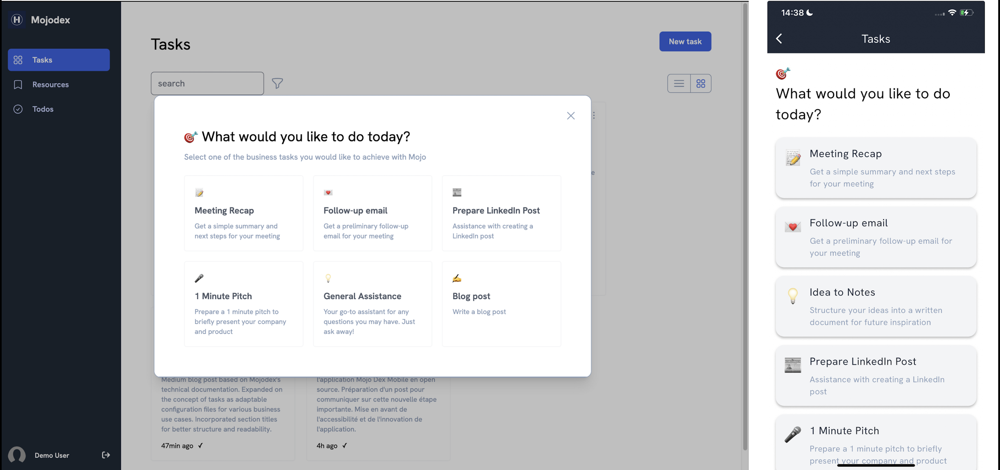
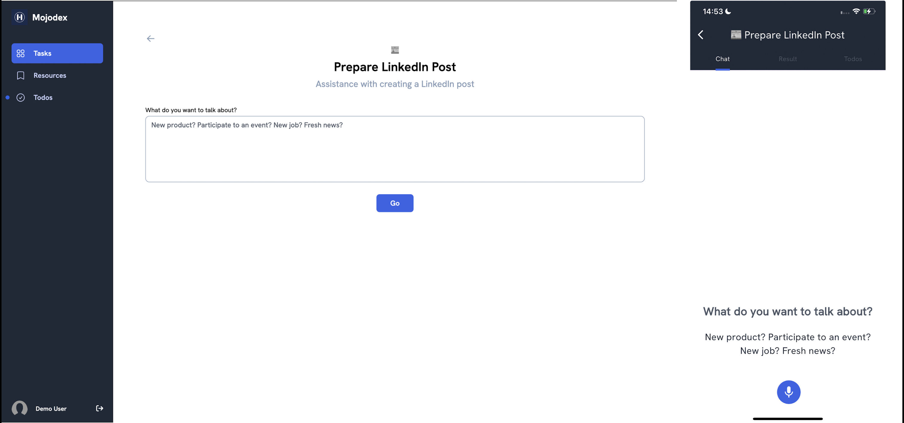
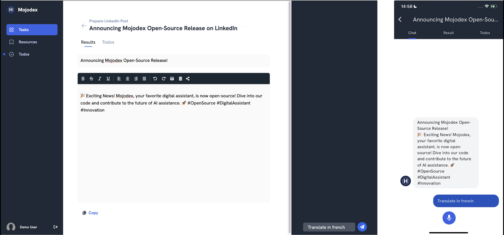

# What's a task?

## Task
A task on Mojodex is a discrete piece of work, inspired by the [JRC-Eurofound Tasks Framework](https://joint-research-centre.ec.europa.eu/scientific-activities-z/employment/job-tasks-and-work-organisation_en) and [O*NET OnLine](https://www.onetonline.org/), representing various skills and specializations required to accomplish it.

## Why?
We build this "task-centric" assistant to provide the best help to the user, tailored to their needs. Technically, a task is described as a configuration file containing all information the assistant needs. This way, any expert can create a really specific task and the assistant will be able to guide the user through the process of accomplishing it in a conversational, seamless way.

## Mojodex usage
A Mojodex user has access to the task corresponding to their profile. This way, the assistant is completely tailored to the user's needs and can provide the best help.

On the web or mobile app interface, the user directly selects the task they want to accomplish. This makes it easy for the user to ask for the help they need without having to think about how to phrase their request.
The assistant then guides them through the process, asking questions in a conversational way though a chat interface.

Once the assistant collected all the necessary information, it starts drafting the document resulting from the task. The user can then review and ask for any edit in the chat or directly modify the document.

