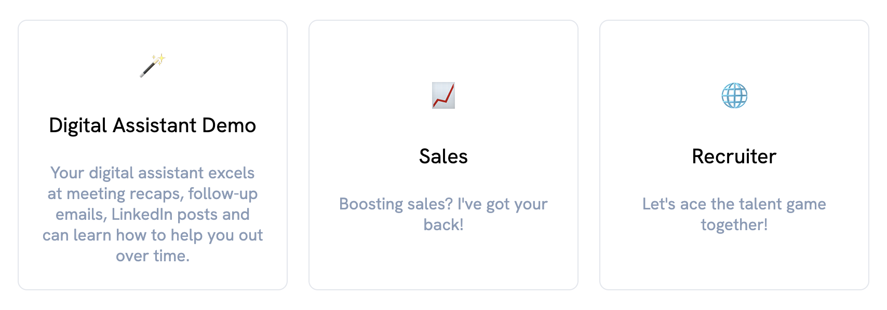
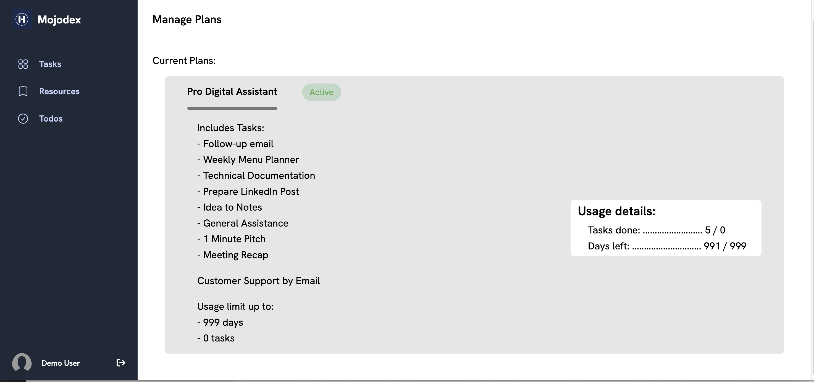

# What's a product?

Product concept is used in Mojodex not only for billing purposes but also to define group of users depending on their profile and needs. Products and purchase are ways to provide each user with a personalized, adapted experience on Mojodex.

## Main concepts

### Product
In Mojodex, a product is set of tasks the user can execute on Mojodex.
A product has:

- a **label** to identify it
- some **display data** to display on the user's interface in their language (name of the product)
- a **status** (active or inactive)
- **free** boolean status : flag to indicate if it's free or not
- a **limit number of tasks** the user can execute using this product
- a **number of days of validity** of the product, after which it expires
- an eventual **ID** that can be used to identify it in the payment system (Stripe or Apple implemented for now)
- a **product_category** to which it belongs

A product is refered as a *subscription* when:
- it has no limit number of tasks
- it has no number of days of validity
In this case, the business model for this product might be a monthly subscription. The subscription is automatically renewed every month, as long as there is no payment default (specific REST API call, made through dedicated webhook for Stripe and Apple).

A product is refered as a *consumable* when it is not a subscription.

A product is refered as *free trial* when it has:
- a limit : in number of days of validity OR in number of tasks
- a free status
> A product category visible by users must have 1 and only 1 free trial product so that the automatic association can be made at onboarding. (see below part Affectation > Free trial)

### Product Task
As mentioned above, a product defines a set of tasks the user can execute on Mojodex. A product task is a task that is part of a product. Those associations are stored in the dedicated DB table `md_product_task`.

### Product category
A product category is a category of products. It is used to group products together and suggest tageted products to the user corresponding to their profile.
A product category has:
- a **label** to identify it
- an **emoji** to display on the user's interface
- some **display data** to display on the user's interface in their language (name and description)
- a **visible** boolean status : flag to indicate if it's visible or not from the user's interface at the time to choose a category
- an **implicit goal**: This goal will be affected to the user account as their initial goal. This goal is then used in the assistant's prompt to drive the assistance by this goal.

### Purchase
A purchase is the relation between a user and a product. It is created when a product is affected to a user, no matter if it's a free trial, a consumable or a subscription.
The purchase object contains metadata about the purchase, such as dates, status, ids...
The purchase will also be used to tag any [user task execution](../tasks/execute_task.md) to keep track of the user's activity.

### User Task
When a new purchase is created (e.g. a product is affected to a user), the user is granted access to the tasks of the product. This creates an association between the user and each task of the product. This association is stored in the dedicated DB table `md_user_task`.

## Affectation

### Product category selection
When a user creates an account, they go through a process we call "onboarding". During this process, the user is asked to select a product category. This category defines the user's profile and will be used to:
- define their initial goal
- affect them a free trial product
- later suggest them adapted products

### Free trial
When a user selects a product category at onboarding, they are automatically affected a free trial product.
A product category must have only 1 single free trial product. This free-trial product will be the one associated to the user at onboarding.

### Purchase services
Later, a user can:
- be affected new products manually by an admin using backoffice APIs
- buy a product through interface

> Important note: A user can't have 2 active subscriptions at the same time. If a user is affected with a new subscription, the previous one is automatically cancelled.

Payment service implemented: [Stripe](https://stripe.com)