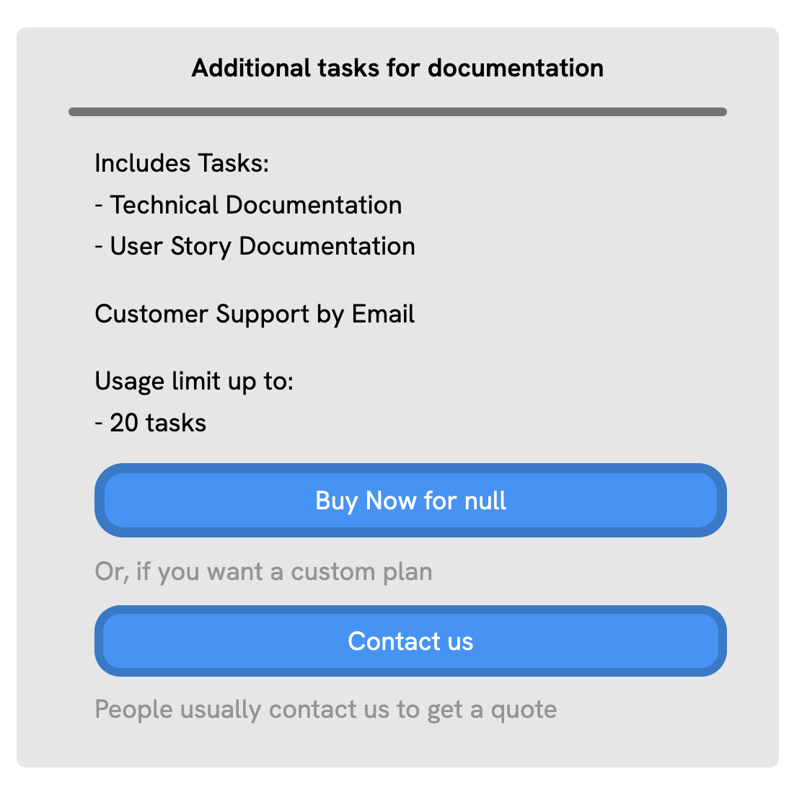
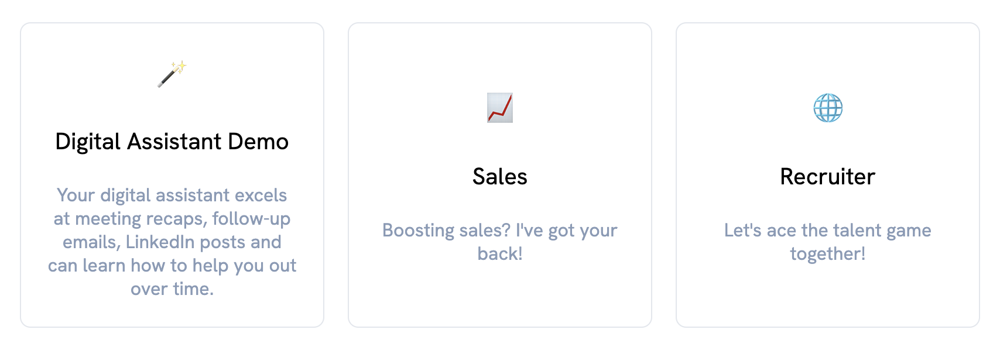

# What's a profile?

Profile concept is used in Mojodex not only for billing purposes but also to define group of users depending on their profile and needs. Profiles and role are ways to provide each user with a personalized, adapted experience on Mojodex.

## Main concepts

### Profile
In Mojodex, a profile is set of tasks the user can execute on Mojodex.
A profile has:

- a **label** to identify it
- some **display data** to display on the user's interface in their language (name of the profile)
- a **status** (active or inactive)
- **free** boolean status : flag to indicate if it's free or not
- a **limit number of tasks** the user can execute using this profile
- a **number of days of validity** of the profile, after which it expires
- an eventual **ID** that can be used to identify it in the payment system (Stripe or Apple implemented for now)
- a **profile_category** to which it belongs

A profile is refered as a *subscription* when:
- it has no limit number of tasks
- it has no number of days of validity
In this case, the business model for this profile might be a monthly subscription. The subscription is automatically renewed every month, as long as there is no payment default (specific REST API call, made through dedicated webhook for Stripe and Apple).

A profile is refered as a *consumable* when it is not a subscription.

A profile is refered as *free trial* when it has:
- a limit : in number of days of validity OR in number of tasks
- a free status
> A profile category visible by users must have 1 and only 1 free trial profile so that the automatic association can be made at onboarding. (see below part Affectation > Free trial)

### Profile Task
As mentioned above, a profile defines a set of tasks the user can execute on Mojodex. A profile task is a task that is part of a profile. Those associations are stored in the dedicated DB table `md_profile_task`.

### Profile category
A profile category is a category of profiles. It is used to group profiles together and suggest tageted profiles to the user corresponding to their profile.
A profile category has:
- a **label** to identify it
- an **emoji** to display on the user's interface
- some **display data** to display on the user's interface in their language (name and description)
- a **visible** boolean status : flag to indicate if it's visible or not from the user's interface at the time to choose a category
- an **implicit goal**: This goal will be affected to the user account as their initial goal. This goal is then used in the assistant's prompt to drive the assistance by this goal.

### Role
A role is the relation between a user and a profile. It is created when a profile is affected to a user, no matter if it's a free trial, a consumable or a subscription.
The role object contains metadata about the role, such as dates, status, ids...
The role will also be used to tag any [user task execution](../tasks/execute_task.md) to keep track of the user's activity.

### User Task
When a new role is created (e.g. a profile is affected to a user), the user is granted access to the tasks of the profile. This creates an association between the user and each task of the profile. This association is stored in the dedicated DB table `md_user_task`.

## Affectation

### Profile category selection
When a user creates an account, they go through a process we call "onboarding". During this process, the user is asked to select a profile category. This category defines the user's profile and will be used to:
- define their initial goal
- affect them a free trial profile
- later suggest them adapted profiles

### Free trial
When a user selects a profile category at onboarding, they are automatically affected a free trial profile.
A profile category must have only 1 single free trial profile. This free-trial profile will be the one associated to the user at onboarding.

### Role services
Later, a user can:
- be affected new profiles manually by an admin using backoffice APIs
- buy a profile through interface

> Important note: A user can't have 2 active subscriptions at the same time. If a user is affected with a new subscription, the previous one is automatically cancelled.

2 payment services have been implemented for now:
- [Stripe](https://stripe.com)
- [Apple in-app purchase](https://developer.apple.com/in-app-purchase/)