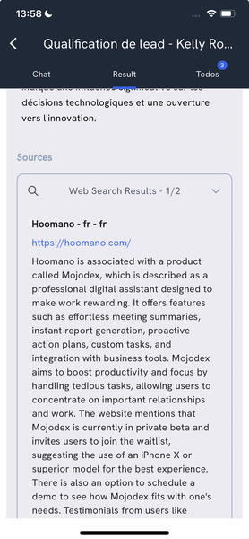

# Background task

A Background task refers to a task that uses a **tool** at some point. This tool can take some time to execute. Therefore, the tool is executed in background without requiring the user to wait for the result.

## Tools
Tools are made of code the agent can execute to gather information needed for task execution.
Those are often API calls, but can also be database queries, file reading, etc.

Tasks are provided with tools at configuration.

Here are implemented tools for now:

| Tool | Label | Description |
| --- | --- | --- |
| Google search | `google_search` | the agent can search for information on the web |
| Internal Memory | `internal_memory` | the agent can search for past task restults |

## Concepts

### Tool
A tool is defined by:

- a name, identifying it both in the database and in the background code
- a definition, explaining what the tool does

Example Tool:

```json
{
    "name": "google_search",
    "definition": "Make some research on Google"
}
```

### Task Tool Association
A task tool is the association of a task with a tool. This association includes a task, a tool and a description of how the tool is used in the task ("usage_description").

Example for tool `google_search` used in task `qualify_lead`:
```json
{
...
    "usage_description": "Use this tool to search for information that could help you qualify the lead.\n Start with a general research about the company to find its industry. A google query made only of the company name is usually the best way to go at first. Make sure you spell the company name correctly. Then look for the company's industry trends, news, and recent events."
}
```

### Task Tool Execution

A Task Tool Execution refers to the execution of a tool in background during a task run time as decided by the assistant.

It is associated to the running User Task Execution and the selected Task Tool Association. It also references the user's approval datetime as required for launching the tool execution.

### Task Tool Query
A tool can be used several times in 1 execution. Each time it is used, a Task Tool Query is created. The maxiumum number of queries is defined by the tool itself.
A Task Tool Query contains:

- the query as json data containing all parameters used for the tool call
- the result date
- the result as a list of json data

## Usage
At task run time, the assistant will be provided with the available tools. At every step in the interaction, it can decide to use one of the available tools.
This is defined in the `data/prompts/tasks/run.txt` prompt template:
```
[...]

TOOLS TO USE
{{task_tool_association.tool_name}}: {{task_tool_association.usage_description}}


[...]
```


If the assistant decides to use a tool, this decision will come along with:

- the name of the tool to use
- an explanation of how it intends to use the tool, addressed to the user

From same file:
```
[...]

{if <need_tool> == yes}
<tool_to_use><tool name></tool_to_use>
<tool_usage><Brief explanation of how you intend to use the tool for the user and ask if they agree.></tool_usage>

[...]
```

In this case, the assistant's response is managed by `backend/app/models/tasks/task_tool_manager.py` that will:

- remove the tags from the assistant's response to extract tool name and the assistant's message to the user
- create a Task Tool Execution in the database

```python

class TaskToolManager:
    [...]

    def manage_tool_usage_text(self, text, user_task_execution_pk, task_tool_associations_json):
        [...]
        mojo_text = self.remove_tags_function(text, self.tool_usage_start_tag, self.tool_usage_end_tag)
        tool_name = self.remove_tags_function(text, self.tool_name_start_tag, self.tool_name_end_tag)
        task_tool_execution = MdTaskToolExecution(
            task_tool_association_fk=self._find_task_tool_association(tool_name, task_tool_associations_json)['task_tool_association_pk'],
            user_task_execution_fk=user_task_execution_pk)
        db.session.add(task_tool_execution)
        db.session.commit()
        [...]
      
```

This response is sent to the frontend and the user must then approve the assistant's tool usage request to trigger tool execution in background. This is done through a call to route POST `backend/app/routes/task_tool_execution.py`. 


This approval call:

- sets the user's approval datetime in the Task Tool Execution object in the database
- triggers the tool execution in background

!!! info
    Background tasks have been implemented on mobile app only for now. The web application still misses route call to approve tool usage request.

> If the user does not approve the tool usage request, the interaction will continue as usual.

```python
class TaskToolExecution(Resource):
    [...]

    def post(self):
        [...]
        task_tool_execution.user_validation = datetime.now()
        [...]
        # Call background for launching execution
        uri = f"{os.environ['BACKGROUND_BACKEND_URI']}/task_tool_execution"
        pload = {'datetime': datetime.now().isoformat(), 'task_tool_execution_pk': task_tool_execution_pk}
        internal_request = requests.post(uri, json=pload)
        [...]

```
In frontend, the user can switch task and come back to this task later when assistant will have executed the tool.

In background, the route call `/task_tool_execution` creates TaskToolExecutionCortex (`background/app/models/cortex/task_tool_execution_cortex.py`).

#### 1. Tool execution
This Cortex's process first launches the appropriate tool execution:
```python
def _run_tool(self, gantry_logger):
    [...]

    tool = tool_class(self.user.user_id, self.task_tool_execution_pk, self.user_task_execution.user_task_execution_pk, self.task.name_for_system, gantry_logger, self.conversation_list)

    [...]

    result = tool.activate(tool_execution_context, self.task_tool.usage_description, self.knowledge_collector, user_id=self.user.user_id)

    [...]
```

The activate function is a loop creating and executing different Task Tool Queries as follow:
##### 1.1 Generate parameters for the tool call
Parameters depends of the tool and their json specification is defined in the tool class. The parameters' generation is done by calling prompt `data/prompts/background/task_tool_execution/generate_tool_params.txt` templated with data including: tool name and definition, usage description, query number, parameters json specification...
The Task Tool Query is created in database with the generated parameters.

##### 1.2 Execute query
The query is then executed using specific tool's code and generated parameters. The function called is `run_tool()`.
This function executes any code from query parameters and returns result as a list of data.
This result will be stored in the previously created Task Tool Query in database.

#### 2. Continue task execution with task tool execution results
To continue the task execution discussion, the assistant will have to present the results of this tool execution to the user.
This message is generated using prompt `data/prompts/background/task_tool_execution/message_writer/message_prompt.txt` templated with many data including task progress and of course the tool execution results.
This message must be a summary of the tool execution results to inform the user about the tool usage outcome.
Once generated, the message is stored in database as any other assistant message.

#### 3. Notify user
If push notifications are enabled, a notification title and text will also be generated and sent to the user's mobile app to inform them that the task is ready to be continued.

> The task interaction then goes on as usual. The assistant is always provided with the available tools and can decide at any step to re-use a tool, for example, if the user asks it to.


Once the tool execution process is over, the queries can be retrieved and displayed to the user.
