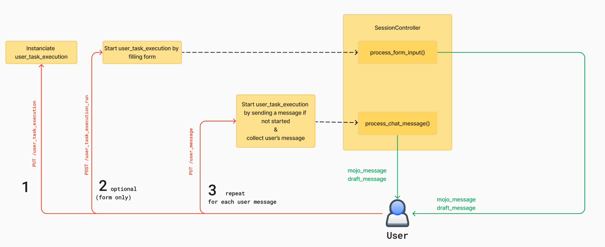

# Task Execution Workflow in Mojodex

This document provides an overview of the concept related to the task execution process in the Mojodex platform and describes the sequence of events that occur from the moment a user initiates a new task execution until the task is completed and the result is delivered.

## Main concepts

The task execution process involves several concepts matching database tables.

#### Task
- Task concept is fully described in [this doc](./whats_a_task.md). Basically, a task is a some work the assistant can help the user with. A task is fully configurable.

#### User Task
- Each user has its own set of tasks it can launch with Mojodex.  A `user_task` stands for the association between a user and a task. Those association are defined by user's product (detailled in a coming doc).

#### User Task Execution
- A `user_task_execution` represents the instance of a task being executed by a user. It captures various details such as the start time and any relevant metadata pertaining to the execution of a specific task by a user.

> Note, sometimes refered as `task_execution` for short.

#### Session
- A `session` represents an interaction between the user and the assistant. It captures the messages exchanged between the user and the assistant, as well as the state of the conversation at any given time. A `user_task_execution` always needs a `session` for the user and its assistant to co-work on the task.

> Note: With existing interface, a `user_task_execution` has 1 `session` and a `session` has 1 `user_task_execution`. This is a 1-1 relationship.
> This being said, the architecture is prepared for 1 `session` to have multiple `user_task_execution` in the future, for example using a more general chat with routing to specific tasks.

#### Message
- A `message` represents a single message exchanged between the user and the assistant within a session. It captures the content of the message, sender, timestamp of the message, and other relevant metadata depeding on the type of message. In the database, a `json` field is used to store the content of the message, allowing high flexibility regarding stored data.

#### Produced text
- A `produced_text` represents the result of a task execution. It contains all versions of the result as references to `produced_text_version`

#### Produced text version
- A `produced_text_version` represents a version of the result of a task execution. It contains the content of the result and the date of the version.


## Task execution workflow

The task execution workflow is a sequence of events that occur from the moment a user initiates a new task execution until the task is completed and the result is delivered. The workflow is described below.

### 1. User Task Execution Creation
Creation of execution is done as soon as the user hits the card of the task they want to create.


This generates a call to PUT `/user_task_execution` to the backend (`backend/app/routes/user_task_execution.py`), specifying the `user_task` the user wants to execute.
This call creates a User Task Execution instance in the database and a `session` if not already exists (which is the case in current Mojodex implementations).

```python
from mojodex_core.entities import MdUserTaskExecution
[...]
class UserTaskExecution(Resource):
    [...]
    def put(self, user_id): 
        [...]
        session_creation = self.session_creator.create_session(user_id, platform, "form")
        [...]
        session_id = session_creation[0]["session_id"]
        [...]
        task_execution = MdUserTaskExecution(user_task_fk=user_task_pk,
                                                json_input_values=empty_json_input_values, session_id=session_id)
        db.session.add(task_execution)
        db.session.commit()
```

This call also returns the input fields to display to the user in the interface so that user have the instructions to start. Those input fields are the one defined in [the task's json configuration file as `json_input`](../../guides/tasks/task_spec.json).
```python
return {**{"user_task_execution_pk": task_execution.user_task_execution_pk,
                     "json_input": json_input,
                     "actions": predefined_actions,
                     "text_edit_actions" : recover_text_edit_actions(user_task_pk=user_task_pk)
                     }, **session_creation[0]}, 200
```


### 2. User Task Execution Start
From those instructions, there are 2 ways to start the task:

#### 2.1. User Task Execution Start from filled form
This is the method used in the web interface. The user fills the form and submit it. This generates a call to POST `/user_task_execution_run` to the backend (`backend/app/routes/user_task_execution_run.py`), specifying the `user_task_execution_pk` received at previous step and the values of filled form.

Resource associated to the route updated the User Task Execution instance and instanciates a `Task Manager`(`backend/app/models/task/task_manager.py`).

Finally, it launches in a parallel thread the start of the task by running task_manager.`start_task_from_form` method.

```python
[...]
class UserTaskExecutionRun(Resource):
    [...]
    def post(self, user_id):
        [...]
        user_task_execution.start_date = datetime.now()
        db.session.commit()
        [...]
        task_manager = TaskManager(user, user_task_execution.session_id, platform, voice_generator,
                                    mojo_messages_audio_storage,
                                    task=task,
                                    user_task_execution=user_task_execution)
        def browse_missing_info_callback(app_version, task_manager, use_message_placeholder, use_draft_placeholder, tag_proper_nouns):
                task_manager.start_task_from_form(app_version, use_message_placeholder=use_message_placeholder, use_draft_placeholder=use_draft_placeholder, tag_proper_nouns=tag_proper_nouns)
                return

        [...]

        server_socket.start_background_task(browse_missing_info_callback, app_version, task_manager, use_message_placeholder, use_draft_placeholder, platform=="mobile")
```

The `Task Manager` is the epicenter of task execution. The function `start_task_from_form()` will:
- Asynchronously call the Background to ask for a task execution title and summary generation
- Prepare first assistant's response to the user.

> The Task Manager detailled flow is described in part 3.


#### 2.2. User Task Execution Start from user message
On the mobile app, the user sees the same instructions as in the web's form but is free to send to the assistant the first message they want. 

This first message generates a call to PUT `/user_message` (`backend/app/routes/user_message.py`) specifying the `user_task_execution_pk` received at previous step and the message content.

This route can be called for any user message, at any step in the task execution process to send user's message to backend. If it appears the User Task Execution identified by the `user_task_execution_pk` is not started, it will start it.

```python
[...]
class UserMessage(Resource):
    [...]
    def put(self, user_id):
        [...]
        user_task_execution = db.session.query(MdUserTaskExecution) \
            .join(MdUserTask, MdUserTaskExecution.user_task_fk == MdUserTask.user_task_pk) \
            .filter(MdUserTaskExecution.user_task_execution_pk == user_task_execution_pk) \
            .filter(MdUserTask.user_id == user_id) \
            .first()
        [...]

        if user_task_execution.start_date is None:
            user_task_execution.start_date = datetime.now()
            db.session.commit()
        [...]
```

Once the User Task Execution is updated, the Resource will instanciate a `Session` object (`backend/app/models/session.py`), responsible for managing user and assistant messages exchanges.

Finally, it launched a parallel thread in which it runs method `receive_human_message` of `Session`.
    
```python
[...]
class UserMessage(Resource):
    [...]
    def put(self, user_id):
        [...]
        from models.session import Session as SessionModel
        session = SessionModel(session_id)

        session_message = {"text": message.message["text"], "message_pk": message.message_pk,
                            "audio": not "text" in request.form, "user_task_execution_pk":user_task_execution_pk,
                            "home_chat_pk": home_chat.home_chat_pk if home_chat else None,
                                "message_date": message_date.isoformat(),
                            "use_message_placeholder": use_message_placeholder, "use_draft_placeholder": use_draft_placeholder}

        server_socket.start_background_task(session.receive_human_message, "user_message", session_message)
        [...]
```

The `receive_human_message` method will:
- Check the message is a task execution message
- Instanciate a Task Manager
- Call method `response_to_user_message` of the Task Manager

```python
[...]
class Session:
    [...]
    def receive_human_message(self, event_name, message):
        [...]
        response_event_name, response_message = self.__manage_task_session(message, app_version)
        [...]
    
    def __manage_task_session(self, message, app_version):
        [...]
        task_manager = TaskManager(self._get_user(), self.id, self.__get_platform(), self.voice_generator, self.__get_mojo_messages_audio_storage())
        [...]
        response_event_name, response_message = task_manager.response_to_user_message(app_version, user_message=message,
                                                                                        mojo_token_callback=self._mojo_token_callback,
                                                                                            tag_proper_nouns=tag_proper_nouns)
        [...]
        return response_event_name, response_message
[...]
```

> The Task Manager detailled flow is described in part 3.


     
### 3. Task Manager
The `Task Manager` is the epicenter of task execution. It is responsible for managing the execution of a task by the user and the assistant.
The core method of the `Task Manager` is `__answer_user()` which is called to generate an answer to the user's message.
Let's break this method down.

> Note: if you have a look at the whole method, you will notice some boolean variables `use_placeholders` that can be passed as arguments of the method. Those have been set to limit tokens consumption while testing. We won't detail them in this doc.

#### 3.1. Data collection
First, the task manager collects all the data it needs to answer the user's message. Those data will be used to render Jinja2 template and generate the assistant's prompt.

```python
[...]
user_task_inputs = [{k: input[k] for k in
                                 ("input_name", "description_for_system", "type", "value")} for input in
                                self.task_execution.json_input_values if input["value"]]

if len(user_task_inputs) == 0:
    user_task_inputs = None

self.produced_text_done = self.__get_produced_text_done()
mojo_knowledge = KnowledgeManager.get_mojo_knowledge()
global_context = KnowledgeManager.get_global_context_knowledge()
user_company_knowledge = KnowledgeManager.get_user_company_knowledge(self.user_task.user_id)
```

#### 3.2. Prompt preparation

> 💡The advanced prompting strategy used in the Task Manager is described in detail in the following article: [Advanced Prompting Strategies for Digital Assistant Development](https://blog.hoomano.com/advanced-prompting-strategies-for-digital-assistant-development-b6698996954f)

The task manager's `prompt` is prepared in 3 steps:
- Load Jinja2 template from `/data` directory
- Render Jinja2 template with collected data
- Add the prompt as the first message of the conversation list in this session


```python
[...]
with open(self.answer_user_prompt, 'r') as f:
    template = Template(f.read())

    mega_prompt = template.render(mojo_knowledge=mojo_knowledge,
                                    global_context=global_context,
                                    username=self.username,
                                    user_company_knowledge=user_company_knowledge,
                                    task=self.task,
                                    user_task_inputs=user_task_inputs,
                                    produced_text_done=self.produced_text_done,
                                    language=self.language,
                                    audio_message=self.platform == "mobile",
                                    tag_proper_nouns=tag_proper_nouns,
                                    title_start_tag=TaskProducedTextManager.title_start_tag,
                                    title_end_tag=TaskProducedTextManager.title_end_tag,
                                    draft_start_tag=TaskProducedTextManager.draft_start_tag,
                                    draft_end_tag=TaskProducedTextManager.draft_end_tag,
                                    task_tool_associations=self.task_tool_associations_json
                                    )

    conversation_list = self.__get_conversation_as_list()
    messages = [{"role": "system", "content": mega_prompt}] + conversation_list
[...]
```

#### 3.3. LLM call
The LLM call is provided with various parameters and a stream callback function that will stream assistant's tokens on the go to user's interface.

```python
[...]
responses = TaskManager.user_answerer.invoke(messages, self.user_task.user_id,
                                                           temperature=0, max_tokens=2000,
                                                           user_task_execution_pk=self.task_execution.user_task_execution_pk,
                                                           task_name_for_system=self.task.name_for_system,
                                                           stream=True,
                                                           stream_callback=self.__super_prompt_token_callback,
                                                           )
response = responses[0].strip()
[...]
```

#### 3.4. Response analysis
Once LLM call completed, we can analyse the answer.

At first call, when the task execution is just started, the prompt asks for the assistant to spot the language used by the user in the first information they provided. This is useful to affect a language per session instead of per user to let the user address their assistant in any language.
To check if the assistant spotted the language, we look for the language tag in the response. If found, we update the session with the language and commit the change.

```python
[...]
if self.language is None and TaskManager.user_language_start_tag in response:
    try:
        self.language = TaskManager.remove_tags_from_text(response, TaskManager.user_language_start_tag,
                                                            TaskManager.user_language_end_tag).lower()
        self.logger.info(f"language: {self.language}")
        # update session
        db_session = db.session.query(MdSession).filter(MdSession.session_id == self.session_id).first()
        db_session.language = self.language
        db.session.commit()
    except Exception as e:
        db.session.rollback()
        self.logger.error(f"Error while updating session language: {e}")
[...]
```

Then, we check for specific tags that will determine the nature of the response. For now, 3 types of responses can be generated. Those 3 types are each handled by a specific object:

##### TaskInputsManager
- TaskInputsManager handles a response indicating the assistant needs more information from the user to complete the task. In this case, the response format will include a question addressed to the user enclosed in specific tags.
```python
[...]
if TaskInputsManager.ask_user_input_start_tag in response:
    return self.task_input_manager.manage_ask_input_text(response)
[...]
```
Basically, the TaskInputsManager will extract the question addressed to the user from the LLM response by removing the tags so that it can be displayed properly to the user.

##### TaskToolManager
- TaskToolManager handles a response indicating the assistant needs to use a specific tool to complete the task. In this case, the response format will include a message indicating :
- the tool to use enclosed in specific tags.
- an explanation, addressed to the user, of how the assistant intends to use the tool for the task, also enclosed in specific tags.
```python
[...]
if TaskToolManager.tool_usage_start_tag in response:
    return self.task_tool_manager.manage_tool_usage_text(response, self.task_execution.user_task_execution_pk, self.task_tool_associations_json)
[...]
```
There, the TaskToolManager will:
- instanciate a Task Tool Execution in the database
- extract the explanation addressed to the user by removing the tags so that it can be displayed properly to the user.
It will return a map containing message metadata with text to display to the user but also the primary key of the Task Tool Execution in database to indicate a special message to the UI receving the response, which can then decide of a specific display for this message.

##### TaskExecutionManager
- TaskExecutionManager handles a response indicating the assistant has completed the task. In this case, the response format will include the result of the task enclosed in specific tags.
```python
[...]
if TaskExecutor.execution_start_tag in response:
    return self.task_executor.manage_execution_text(execution_text=response, task=self.task, task_displayed_data=self.task_displayed_data,
                                                    user_task_execution_pk=self.task_execution.user_task_execution_pk,
                                                    user_message=user_message,
                                                    app_version = app_version,
                                                    use_draft_placeholder=use_draft_placeholder)
[...]
```

The TaskExecutionManager will:
- remove tags from the response to extract the result of the task in different format:
    - title of the produced text
    - body of the produced text
    - produced text as a message the assistant could have written (```f"{title}\n{body}"```)
- instanciate a Produced Text in the database if not already done
- instanciate a Produced Text Version in the database and store the result of the task
- send the message on SocketIO dedicated event: `draft_message`

#### 3.5. Response to user
Finally, the method `__answer_user` returns the assistant's message that should be sent to the user (or None if it was a `draft_message` managed by TaskExecutionManager).

If an assistant's message is returned, it's the component that called `__answer_user` that is responsible for sending it to the user.
In most cases, this component is the `Session` object. 
Only if the call came from starting a task from a form, the Task Manager `start_task_from_form` method will take care of sending.


### 4. Iterating on a task

The task execution process is an iterative process. The user and the assistant exchange messages until the user is satisfied with the produced result.

When the assistant sends a message to ask for any precision or when they want to ask for an edition, the user can send a message through the chat interface to interact with the assistant.

When the user sends a message during a task execution, the message is sent to the backend through a PUT `user_message` call and the same process as described in part 2.2 is repeated.

> Note: the web application as it is now still uses a socketio event `user_message` to send user's message to the backend. We started moving from this to the REST API `/user_message` as described here for robustness and scalability reasons. Mobile application already uses the REST API.

