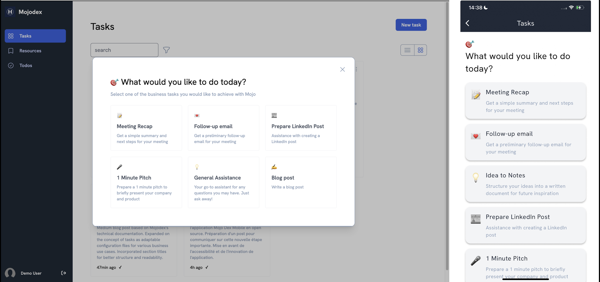
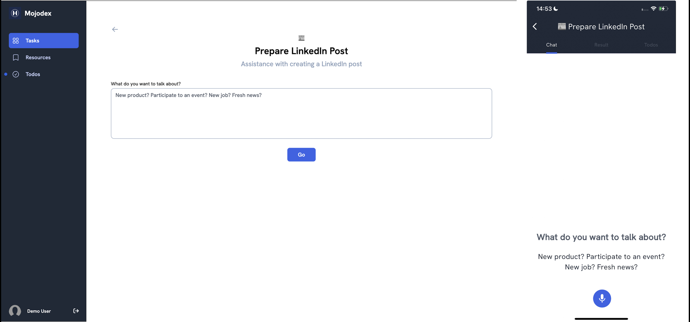

# Instruct Task Execution Workflow in Mojodex

This document provides an overview of the concept related to the task execution process in the Mojodex platform and describes the sequence of events that occur from the moment a user initiates a new task execution until the task is completed and the result is delivered.

## Main concepts

The task execution process involves several concepts matching database tables.

#### Task
- Task concept is fully described in [this doc](./whats_a_task.md). Basically, a task is a some work the assistant can help the user with. A task is fully configurable. A task can be of type "instruct" or "workflow".
> This documentation

#### User Task
- Each user has its own set of tasks it can launch with Mojodex.  A `user_task` stands for the association between a user and a task. Those association are defined by user's product (detailled in a coming doc).

#### User Task Execution
- A `user_task_execution` represents the instance of a task being executed by a user. It captures various details such as the start time and any relevant metadata pertaining to the execution of a specific task by a user.

> Note, sometimes refered as `task_execution` for short.

#### Session
- A `session` represents an interaction between the user and the assistant. It captures the messages exchanged between the user and the assistant, as well as the state of the conversation at any given time. A `user_task_execution` always needs a `session` for the user and its assistant to co-work on the task.

> Note: With existing interface, a `user_task_execution` has 1 `session`.
> 1 `session` can have multiple `user_task_execution`, for example using a more general chat with routing to specific tasks.

#### Message
- A `message` represents a single message exchanged between the user and the assistant within a session. It captures the content of the message, sender, timestamp of the message, and other relevant metadata depeding on the type of message. In the database, a `json` field is used to store the content of the message, allowing high flexibility regarding stored data.

#### Produced text
- A `produced_text` represents the result of a task execution. It contains all versions of the result as references to `produced_text_version`

#### Produced text version
- A `produced_text_version` represents a version of the result of a task execution. It contains the content of the result and the date of the version.


## Task execution workflow

The task execution workflow is a sequence of events that occur from the moment a user initiates a new task execution until the task is completed and the result is delivered. The workflow is described below.

### 1. User Task Execution Creation
Creation of execution is done as soon as the user hits the card of the task they want to create.



This generates a call to PUT `/user_task_execution` to the backend (`backend/app/routes/user_task_execution.py`), specifying the `user_task` the user wants to execute.
This call creates a User Task Execution instance in the database and a `session` if not already exists (which is the case in current Mojodex implementations).

```python
from mojodex_core.entities import MdUserTaskExecution
[...]
class UserTaskExecution(Resource):
    [...]
    def put(self, user_id): 
        [...]
        session_creation = self.session_creator.create_session(user_id, platform, "form")
        [...]
        session_id = session_creation[0]["session_id"]
        [...]
        task_execution = MdUserTaskExecution(user_task_fk=user_task_pk,
                                                json_input_values=empty_json_input_values, session_id=session_id)
        db.session.add(task_execution)
        db.session.commit()
```

This call also returns the input fields to display to the user in the interface so that user have the instructions to start. Those input fields are the one defined in [the task's json configuration file as `json_input`](../../guides/tasks/task_spec.json).
```python
return {**{"user_task_execution_pk": task_execution.user_task_execution_pk,
                     "json_input": json_input,
                     "actions": predefined_actions,
                     "text_edit_actions" : recover_text_edit_actions(user_task_pk=user_task_pk)
                     }, **session_creation[0]}, 200
```




### 2. User Task Execution Start
From those instructions, there are 2 ways to start the task:

#### 2.1. User Task Execution Start from filled form
This is the method used in the web interface. The user fills the form and submit it. This generates a call to POST `/user_task_execution_run` to the backend (`backend/app/routes/user_task_execution_run.py`), specifying the `user_task_execution_pk` received at previous step and the values of filled form.

Resource associated to the route updates the User Task Execution instance and instanciates a `Session`(`backend/app/models/session/session.py`).

Finally, it launches in a parallel thread the start of the task by running session.`process_form_input` method.

```python
[...]
class UserTaskExecutionRun(Resource):
    [...]
    def post(self, user_id):
        [...]
        user_task_execution.start_date = datetime.now()
        db.session.commit()
        [...]
        from models.session.session import Session as SessionModel
        session = SessionModel(user_task_execution.session_id)
        def launch_process(session, app_version, platform, user_task_execution_pk, use_message_placeholder, use_draft_placeholder):
            session.process_form_input( app_version, platform, user_task_execution_pk, use_message_placeholder=use_message_placeholder, use_draft_placeholder=use_draft_placeholder)
            return
        [...]
        server_socket.start_background_task(launch_process, session, app_version, platform, user_task_execution_pk, use_message_placeholder, use_draft_placeholder)
```

The `Session` is the epicenter of task execution. The function `process_form_input()` will:
- Asynchronously call the Background to ask for a task execution title and summary generation
- Prepare first assistant's response to the user.

> The Task Manager detailled flow is described in part 3.


#### 2.2. User Task Execution Start from user message
On the mobile app, the user sees the same instructions as in the web's form but is free to send to the assistant the first message they want. 

This first message generates a call to PUT `/user_message` (`backend/app/routes/user_message.py`) specifying the `user_task_execution_pk` received at previous step and the message content.

This route can be called for any user message, at any step in the task execution process to send user's message to backend. If it appears the User Task Execution identified by the `user_task_execution_pk` is not started, it will start it.

```python
[...]
class UserMessage(Resource):
    [...]
    def put(self, user_id):
        [...]
        user_task_execution = db.session.query(MdUserTaskExecution) \
            .join(MdUserTask, MdUserTaskExecution.user_task_fk == MdUserTask.user_task_pk) \
            .filter(MdUserTaskExecution.user_task_execution_pk == user_task_execution_pk) \
            .filter(MdUserTask.user_id == user_id) \
            .first()
        [...]

        if user_task_execution.start_date is None:
            user_task_execution.start_date = datetime.now()
            db.session.commit()
        [...]
```

Once the User Task Execution is updated, the Resource will instanciate a `Session` object (`backend/app/models/session.py`), responsible for managing user and assistant messages exchanges.

Finally, it launched a parallel thread in which it runs method `process_chat_message` of `Session`.
    
```python
[...]
class UserMessage(Resource):
    [...]
    def put(self, user_id):
        [...]
        from models.session import Session as SessionModel
        session = SessionModel(session_id)

        session_message = {"text": message.message["text"], "message_pk": message.message_pk,
                            "audio": not "text" in request.form, "user_task_execution_pk":user_task_execution_pk,
                            "home_chat_pk": home_chat.home_chat_pk if home_chat else None,
                                "message_date": message_date.isoformat(),
                            "use_message_placeholder": use_message_placeholder, "use_draft_placeholder": use_draft_placeholder}

        server_socket.start_background_task(session.process_chat_message, "user_message", session_message)
        [...]
```

The `process_chat_message` method will:
- Check the message is a task execution message
- Instanciate a Task Manager
- Call appropriate `assistant_response_generator` to generate the assistant's response to the user.

```python
[...]
class Session:
    [...]
    def process_chat_message(self, event_name, message):
        [...]
        response_event_name, response_message = self.__manage_task_session(message, app_version)
        [...]
    
    def __manage_task_session(self, platform, user_task_execution_pk, use_message_placeholder=False, use_draft_placeholder=False):
        [...]
            return self.__manage_instruct_task_session(platform, user_task_execution_pk, use_message_placeholder, use_draft_placeholder)
        [...]

    def __manage_instruct_task_session(self, platform, user_task_execution_pk, use_message_placeholder=False, use_draft_placeholder=False):
        [...]
            tag_proper_nouns = platform == "mobile"
            task_assistant_response_generator = InstructTaskAssistantResponseGenerator(mojo_message_token_stream_callback=self._mojo_message_stream_callback,
                                                                              draft_token_stream_callback=self._produced_text_stream_callback,
                                                                              use_message_placeholder=use_message_placeholder,
                                                                               use_draft_placeholder=use_draft_placeholder,
                                                                               tag_proper_nouns=tag_proper_nouns,
                                                                               user=self._get_user(),
                                                                               session_id=self.id,
                                                                               user_messages_are_audio= platform=="mobile",
                                                                               running_user_task_execution_pk=user_task_execution_pk)

            response_message = task_assistant_response_generator.generate_message()
            response_language = task_assistant_response_generator.context.state.current_language
            return response_message, response_language
        [...]
[...]
```

> The Task Manager detailled flow is described in part 3.


     
### 3. InstructTaskAssistantResponseGenerator
The `InstructTaskAssistantResponseGenerator` is the epicenter of task execution. It is responsible for managing the execution of a task by the user and the assistant.
Its inheritance tree is as follows:
- `AssistantMessageGenerator`: responsible for generating the assistant's message to the user
    - `AssistantResponseGenerator`: responsible for generating the assistant's response to the user (used in the context of a response)
        - `TaskEnabledAssistantResponseGenerator`: Specified in collecting the task execution context
            - `InstructTaskEnabledAssistantResponseGenerator`: Holds the prompt and instruct tasks tags management
                - `InstructTaskAssistantResponseGenerator`
                

The core method of those object lies in `AssistantMessageGenerator` method `generate_message`.

```python
class AssistantMessageGenerator(ABC):
    [...]
    def generate_message(self):
        [...]
            placeholder = self._handle_placeholder()
            if placeholder:
                return placeholder
            prompt = self._render_prompt_from_template()
            llm_output = self._generate_message_from_prompt(prompt)
            if llm_output:
                return self._handle_llm_output(llm_output)
            return None
[...]
```

Let's break this method down.

> Note: We won't deal with placeholders, those are basically useful to return a placeholder instead of a LLM generated message for development purposes.

#### 3.1. Prompt preparation
First, the assistant collects all the data it needs to answer the user's message. Those data will be used to render Jinja2 template and generate the assistant's prompt.

Some data are stored in context, other in KnowledgeManager and some need specific calls to database to be collected.

```python
class InstructTaskEnabledAssistantResponseGeneratorTaskEnabledAssistantResponseGenerator, ABC)::
    [...]
    def _render_prompt_from_template(self):
        try:
            mojo_knowledge = KnowledgeManager.get_mojo_knowledge()
            global_context = KnowledgeManager.get_global_context_knowledge()
            user_company_knowledge = KnowledgeManager.get_user_company_knowledge(self.context.user_id)
            available_user_tasks = self.__get_available_user_instruct_tasks()
            task_specific_instructions = self.__get_specific_task_instructions(self.running_task) if self.running_task else None
            produced_text_done = self.context.state.get_produced_text_done()

            return self.prompt_template.render(mojo_knowledge=mojo_knowledge,
                                                    global_context=global_context,
                                                    username=self.context.username,
                                                    user_company_knowledge=user_company_knowledge,
                                                    tasks = available_user_tasks,
                                                    running_task=self.running_task,
                                                    task_specific_instructions=task_specific_instructions,
                                                    produced_text_done=produced_text_done,
                                                    audio_message=self.context.user_messages_are_audio,
                                                    tag_proper_nouns=self.tag_proper_nouns,
                                                    language=None
                                                    )
        except Exception as e:
            raise Exception(f"{InstructTaskEnabledAssistantResponseGenerator.logger_prefix} _render_prompt_from_template :: {e}")

[...]
```

> 💡The advanced prompting strategy used in the Task Manager is described in detail in the following article: [Advanced Prompting Strategies for Digital Assistant Development](https://blog.hoomano.com/advanced-prompting-strategies-for-digital-assistant-development-b6698996954f)

The Jinja2 prompt is rendered using collecting data.
At next step, it will be used as the content of initial system message of list of messages to send to LLM.


#### 3.2. LLM call
The LLM call is provided with various parameters and a stream callback function that will stream assistant's tokens on the go to user's interface.

```python
class AssistantResponseGenerator(AssistantMessageGenerator, ABC):
    [...]
    def _generate_message_from_prompt(self, prompt):
       [...]
        conversation_list = self.context.state.get_conversation_as_list(self.context.session_id)
        messages = [{"role": "system", "content": prompt}] + conversation_list
        responses = model_loader.main_llm.invoke(messages, self.context.user_id,
                                                    temperature=0,
                                                    max_tokens=4000,
                                                    label="CHAT",
                                                    stream=True, stream_callback=self._token_callback)

        return responses[0].strip() if responses else None
        [...]
[...]
```

#### 3.3. Response analysis
Once LLM call completed, we can analyse the answer.

The prompt asks for the assistant to spot the language used by the user in the first information they provided. This is useful to adapt the assistant's response to the user's language dynamically during the task.
To check if the assistant spotted the language, we look for the language tag in the response. If found, we update the session with the language and commit the change.

```python
class AssistantResponseGenerator(AssistantMessageGenerator, ABC):
[...]
    def __manage_response_language_tags(self, response):
        """
        Remove language tags from the response and update the language in the context
        :param response: response
        """
        try:
            if AssistantResponseGenerator.user_language_start_tag in response:
                try:
                    self.context.state.current_language = AssistantMessageGenerator.remove_tags_from_text(response, AssistantResponseGenerator.user_language_start_tag,
                                                                        AssistantResponseGenerator.user_language_end_tag).lower()
                except Exception as e:
                    pass
        except Exception as e:
            raise Exception(f"__manage_response_language_tags:: {e}")
[...]
```

Then, we check for specific tags that will determine the nature of the response.
```python
class InstructTaskEnabledAssistantResponseGenerator(TaskEnabledAssistantResponseGenerator, ABC):
    [...]
    def _manage_response_task_tags(self, response):
        [...]
        if TaskInputsManager.ask_user_input_start_tag in response:
            return self.task_input_manager.manage_ask_input_text(response)
        if TaskToolManager.tool_usage_start_tag in response:
            return self.task_tool_manager.manage_tool_usage_text(response,
                                                                    self.running_user_task_execution.user_task_execution_pk,
                                                                    self._get_task_tools_json(self.running_task))
        return {"text": response}
        [...]

    def _manage_execution_tags(self, response):
        [...]
            if ExecutionManager.execution_start_tag in response:
                return self.execution_manager.manage_execution_text(response, self.running_task, self.running_task_displayed_data,
                                          self.running_user_task_execution, self.task_executor,
                                          use_draft_placeholder=self.use_draft_placeholder)
        [...]
    
    def _manage_response_tags(self, response):
        execution = self._manage_execution_tags(response)
        if execution:
            return execution
        return self._manage_response_task_tags(response)
```

For now, 3 types of responses can be generated. Those 3 types are each handled by a specific object:

##### TaskInputsManager
- TaskInputsManager handles a response indicating the assistant needs more information from the user to complete the task. In this case, the response format will include a question addressed to the user enclosed in specific tags.
```python
[...]
if TaskInputsManager.ask_user_input_start_tag in response:
    return self.task_input_manager.manage_ask_input_text(response)
[...]
```
Basically, the TaskInputsManager will extract the question addressed to the user from the LLM response by removing the tags so that it can be displayed properly to the user.

##### TaskToolManager
- TaskToolManager handles a response indicating the assistant needs to use a specific tool to complete the task. In this case, the response format will include a message indicating :
- the tool to use enclosed in specific tags.
- an explanation, addressed to the user, of how the assistant intends to use the tool for the task, also enclosed in specific tags.
```python
[...]
if TaskToolManager.tool_usage_start_tag in response:
    return self.task_tool_manager.manage_tool_usage_text(response,
                                                            self.running_user_task_execution.user_task_execution_pk,
                                                            self._get_task_tools_json(self.running_task))
[...]
```
There, the TaskToolManager will:
- instanciate a Task Tool Execution in the database
- extract the explanation addressed to the user by removing the tags so that it can be displayed properly to the user.
It will return a map containing message metadata with text to display to the user but also the primary key of the Task Tool Execution in database to indicate a special message to the UI receving the response, which can then decide of a specific display for this message.

##### ExecutionManager
- ExecutionManager handles a response indicating the assistant has completed the task by produceing a text. In this case, the response format will include the result of the task enclosed in specific tags.
```python
[...]
if ExecutionManager.execution_start_tag in response:
    return self.execution_manager.manage_execution_text(response, self.running_task, self.running_task_displayed_data,
                                self.running_user_task_execution, self.task_executor,
                                use_draft_placeholder=self.use_draft_placeholder)
[...]
```

The ExecutionManager will:
- remove tags from the response to extract the result of the task in different format:
    - title of the produced text
    - body of the produced text
    - produced text as a message the assistant could have written (```f"{title}\n{body}"```)
- instanciate a Produced Text in the database if not already done
- instanciate a Produced Text Version in the database and store the result of the task
- send the message on SocketIO dedicated event: `draft_message`

#### 3.5. Response to user
Finally, the method `generate_message` returns the assistant's message that should be sent to the user (or None if it was a `draft_message` managed by TaskExecutionManager).

Then, the session will get this message, the associated event_name and the eventual detected language, generate audio version if platform is mobile and send mojo message to the user using socketio.


### 4. Iterating on a task

The task execution process is an iterative process. The user and the assistant exchange messages until the user is satisfied with the produced result.

When the assistant sends a message to ask for any precision or when they want to ask for an edition, the user can send a message through the chat interface to interact with the assistant.

When the user sends a message during a task execution, the message is sent to the backend through a PUT `user_message` call and the same process as described in part 2.2 is repeated.

