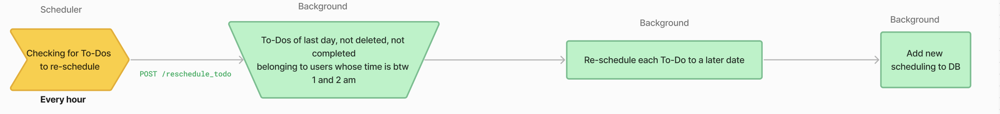

# How To-Do works?

To-dos are stored in the database. Typical technical workflow of a To-Do item is as follow:
1) extracted from a task execution
2) organized later if not achieved
3) reminded to the user
4) cleared by the user

## 1. Extract To-Dos from achieved tasks
Mojodex's scheduler is a python module that triggers routes calls at a certain frequency. See `/scheduler/app/main.py`

One of its trigger checks every 10 minutes if a task has just been achieved.
```python
from scheduled_tasks.extract_todos import ExtractTodos
[...]
ExtractTodos(600) # extract todos every 10 minutes
[...]
```

> A task is considered 'just achieved' if it has an associated produced_text which last version's date is between 10 and 20 minutes ago. See `backend/app/routes/extract_todos.py`.

Each of those tasks are sent to the background through route `/extract_todos` for processing. 
As a reminder, when a background route is called, the data is processed as follow:

```python
class ExtractTodos(Resource):
    [...]
    def post(self):
            [...]
            extract_todos_cortex = ExtractTodosCortex(user_task_execution)
          
            def run_extract_todos_cortex(cortex):
                try:
                    cortex.extract_todos()
                except Exception as err:
                    print("🔴" + str(err))

            executor.submit(run_extract_todos_cortex, extract_todos_cortex)
            return {"success": "Process started"}, 200
    [...]
```

- A cortex (here `background/app/models/cortex/extract_todos_cortex.py`) is created. At construction, the cortex collects all database entries needed for further processing. This is done to avoid database connection out of main thread.

- Then, the main function of the cortex, responsible for processing data (here `extract_todos()`) is called in an asynchronous way.

The method extract_todos() uses prompt `data/prompts/background/todos/extract_todos.txt`– filled with all tasks data to extract To-Dos out of completed task. Notable instructions of this prompt are:

- Extraction instruction: To define what is a To-Do.
```
[...]
Extract any todo the user mentioned in the task as next steps they have to take.
Those todos describes actions the user will have to do in the future. They cannot be passive.
[...]
```

- Explicitely-mentioned only instruction: To avoid any hallucination from the agent.
```
[...]
Extract ONLY next steps the user explicitly mentioned in the task.
[...]
```

- Assigned-only instruction: To avoid including To-Dos' that could be assigned to the user's contact in an email task or other participant mentioned in a meeting minutes, for example.
```
[...]
Extract ONLY next steps assigned to the user.
[...]
```

The result of the prompt is a json list of dictionnary defining To-Do items.
```json
{
    "todo_definition": "<Definition as it will be displayed in the user's todo list.
        The definition should help the user remember what was the original task.
        Mention any name, company,... that can help them get the context.>",
    "mentioned_as_todo": <Did the user explicitly mentioned this as a todo? yes/no>,
    "due_date": "<Date at which the todo will be displayed in user's todo list. Format yyyy-mm-dd>"
}
```

This json is parsed and items are added to the database, related to the task.


## 2. Organize
Another hourly trigger of the scheduler takes care of reorganizing user's To-Do list every night to keep it up-to-date.

```python
from scheduled_tasks.reschedule_todos import RescheduleTodos
[...]
RescheduleTodos(3600) # reschedule todos every 1 hour
[...]
```

This trigger calls Mojodex's backend route `/todo_scheduling` to retrieve all To-Dos items that:
- Belongs to a user whose local time is between 1am and 2am
- Has not been deleted, nor completed
- Was due for the day before

Each of those To-Dos are sent to the background using route `/reschedule_todos` for processing.

Here, the route uses cortex `backend/app/models/cortex/reschedule_todo_cortex.py` to process the data. The main function of the cortex, responsible for processing data is `reschedule_todo`.

It uses prompt `data/prompts/background/todos/reschedule_todo.txt` provided with:
- related task data
- To-Do item along with the number of times it has already been rescheduled and
- User's To-Do list in upcoming days

```
[...]
Regarding the TASK, TODO ITEM and USER TODO LIST, decide when to reschedule the TODO ITEM for later.
The task was currently scheduled for yesterday.
Provide the new scheduled date.
[...]
```

This prompt outputs a json answer that can be parsed so that a new scheduling can be added to database.



## 3. Remind the user
Here comes Mojodex's scheduler again with another hourly trigger.

`/scheduler/app/main.py`
```python
[...]
emails = 'AWS_ACCESS_KEY_ID' in os.environ and os.environ['AWS_ACCESS_KEY_ID']
if emails:
    [...]
    SendTodoDailyEmails(3600) # send todo daily emails every 1 hour (filtered by timezone)
[...] 
```

> Note that this trigger is only activated if the environment variable `AWS_ACCESS_KEY_ID` is set. This variable is used to send emails through AWS SES, only emails mechanism implemented in Mojodex for now.


This triggers calls Mojodex's backend route `/todo_daily_emails` to retrieve all users whose local time is `DAILY_TODO_EMAIL_TIME` (defined in *env vars* see: `.env.example`).


For each of those users, the assistant will collect all To-Dos that are due for the coming day + the re-organization work it has done (cf step 4) and send those data to the background using route `events_generation` with parameter `'event_type': 'todo_daily_emails'`.

The background uses its `TodoDailyEmailsGenerator` (`background/app/models/events/todo_daily_emails_generator.py`) with prompt `data/prompts/engagement/emails/todo_daily_emails_text_prompt.txt` to draft a friendly reminding emails to send to the user from provided data.

Once an email is ready, the background sends it to the backend using route `/event` with parameters so that the backend sends the email to the user using AWS SES and logs it to the database.

`backend/app/routes/event.py`
```python
[...]
mojo_mail_client.send_mail(subject=subject,
                            recipients=[email],
                            html=body)
# add notification to db
email_event = MdEvent(creation_date=datetime.now(), event_type=event_type,
                        user_id=user_id,
                        message=message)
db.session.add(email_event)
db.session.commit()
[...]
```


## 4. User actions
Users can of course also act on their own To-Dos. For now, they can take 2 actions:
- Delete a To-Do item, if it was not relevant to add it or the assistant made any mistake. As any application call, this call is made to the backend and the route is DELETE `/todo`.
> Note: an item is never deleted for real in the database. It is only marked as deleted so that it does not appear in the user's To-Do list anymore. This is to keep track of all the work the assistant has done.
`backend/app/routes/todo.py`
```python
class Todos(Resource):
    [...]
    def delete(self, user_id):
        [...]
        todo.deleted_by_user = datetime.now()
        db.session.commit()
        [...]
           
```

- Mark a To-Do as completed as soon as they don't need it anymore to remember of the work they have to do. As any application call, this call is made to the backend and the route is POST `/todo`.
`backend/app/routes/todo.py`
```python
class Todos(Resource):
    [...]
    def post(self, user_id):
        [...]
        todo.completed = datetime.now()
        db.session.commit()
        [...]
           
```


> Note: find every API specification in the [Backend API documentation](../../openAPI/backend_api.yaml) and the [Background API documentation](../../openAPI/background_api.yaml)