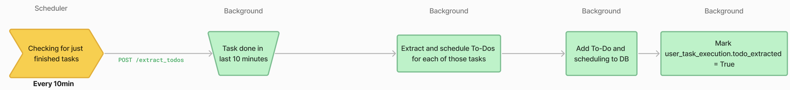

# How To-Do works?

## To-Do extraction

### Trigger
The To-Do extraction is triggered by scheduler through a job that is set to run every 10minutes. Every 10minutes, it sends a request to the `/extract_todo` endpoint on the background.

`scheduler/app/main.py`
```python
from scheduled_tasks.extract_todos import ExtractTodos
[...]
ExtractTodos(600) # extract todos every 10 minutes
[...]    
```

This background route will then select user task executions whose latest `md_produced_text_version` is between 10 and 20 minutes old. Those task executions are considered as "done" and their To-Do items will be extracted.

The extraction process of To-Do items for selected task executions is launched in a parallel thread.

```python
class ExtractTodos(Resource):

    def post(self):
        [...]
        todos_creator = TodosCreator(user_task_execution_pk)
        executor.submit(todos_creator.extract_and_save)
        return {"success": "Process started"}, 200
```

### Extraction process
The extraction process is done by the `TodosCreator` class. This class is instanciated with the `user_task_execution_pk` of the task execution to extract To-Do items from.

`background/app/models/todos/todos_creator.py`
```python
class TodosCreator:

    # The instanciation is done by passing a key and not a DB object to avoid keeping a DB session open while a parallel thread using this object will be launched
    def __init__(self, user_task_execution_pk):
        self.user_task_execution_pk = user_task_execution_pk
        
    # This is the method launched in a parallel thread
    def extract_and_save(self):
        collected_data = self._collect_data()
        json_todos = self._extract(*collected_data)
        [...]
        self._save_to_db(todo['todo_definition'], todo['due_date'])

    @with_db_session
    def _collect_data(self, db_session):
        # This method uses a dedicated db_session to access the database and retrieve all the data needed for the process
        # It does not return any DB object but only required data to avoid keeping the DB session open
        [...]
        user = db_session.query(User) ...
        [...]
        return user.user_id, user.datetime_context, user.name, ...

    def _extract(self, user_id, datetime_context, name, ...):
        # This method processes the raw data provided by _collect_data to extract To-Do items
        [...]

    @with_db_session
    def _save_to_db(self, description, due_date, db_session):
         # create new todo
            new_todo = MdTodo(
                creation_date=datetime.now(),
                description=description,
                user_task_execution_fk=self.user_task_execution_pk
            )
            db_session.add(new_todo)
            [...]
            db_session.commit()
            [...]
```

The method _extract() uses prompt `background/app/instructions/extract_todos.mpt`– filled with all tasks data to extract To-Dos out of completed task. Notable instructions of this prompt are:

- Extraction instruction: To define what is a To-Do.
```
[...]
Extract any todo the user mentioned in the task as next steps they have to take.
Those todos describes actions the user will have to do in the future. They cannot be passive.
[...]
```

- Explicitely-mentioned only instruction: To avoid any hallucination from the agent.
```
[...]
Extract ONLY next steps the user explicitly mentioned in the task.
[...]
```

- Assigned-only instruction: To avoid including To-Dos' that could be assigned to the user's contact in an email task or other participant mentioned in a meeting minutes, for example.

```
[...]
Extract ONLY next steps assigned to the user.
[...]
```

The result of the prompt is a json list of dictionnary defining To-Do items.

```json
{
    "todo_definition": "<Definition as it will be displayed in the user's todo list.
        The definition should help the user remember what was the original task.
        Mention any name, company,... that can help them get the context.>",
    "mentioned_as_todo": <Did the user explicitly mentioned this as a todo? yes/no (in english)>,
    "due_date": "<Date at which the todo will be displayed in user's todo list. Format yyyy-mm-dd>"
}
```
This json is parsed and items are added to the database, related to the task.

Once the To-Do items are extracted, their date format is checked and if it is valid, they are saved in the database.



## To-Do Schedule

### Trigger
Another hourly trigger of the scheduler takes care of reorganizing user's To-Do list every night to keep it up-to-date.

```python
from scheduled_tasks.reschedule_todos import RescheduleTodos
[...]
RescheduleTodos(3600) # reschedule todos every 1 hour
[...]
```

This job calls background `/reschedule_todo` endpoint. This route select every To-Do item that is overdue and associated to a user whose local time is 1am. Those To-Do items are the ones that need to be rescheduled.
The reschedule process of To-Do items is launched in a parallel thread.

```python
class RescheduleTodo(Resource):

    def post(self):
        [...]
            def reschedule_todos_by_batches(todo_pks):
                for todo_pk in todo_pks:
                    todos_rescheduler = TodosRescheduler(todo_pk)
                    todos_rescheduler.reschedule_and_save()

            executor.submit(reschedule_todos_by_batches, todo_pks)
        [...]
            
```

### Reschedule process
The reschedule process is done by the `TodosRescheduler` class. This class is instanciated with the `todo_pk` of the To-Do item to reschedule.

`background/app/models/todos/todos_rescheduler.py`
```python
class TodosRescheduler:

    todos_rescheduler_mpt_filename = "instructions/reschedule_todo.mpt"

    # The instanciation is done by passing a key and not a DB object to avoid keeping a DB session open while a parallel thread using this object will be launched
    def __init__(self, todo_pk):
        self.todo_pk = todo_pk

    # This is the method launched in a parallel thread
    def reschedule_and_save(self):
        [...]
            collected_data = self._collect_data()
            json_result = self._reschedule(*collected_data)
            try:
                # check reminder_date is a DateTime in format yyyy-mm-dd
                reschedule_date=datetime.strptime(json_result['reschedule_date'], "%Y-%m-%d")
            except ValueError:
                [...]
                return
            self._save_to_db(json_result['argument'], reschedule_date)
        [...]
        
    # This method uses a dedicated db_session to access the database and retrieve all the data needed for the process
    # It does not return any DB object but only required data to avoid keeping the DB session open
    @with_db_session
    def _collect_data(self, db_session):
        [...]
        todo, user_task_execution, user = db_session.query(Todo, UserTaskExecution, User)...
        [...]
        return user.user_id, user_task_execution.user_task_execution_pk, ...
        [...]

    @json_decode_retry(retries=3, required_keys=['reschedule_date', 'argument'], on_json_error=on_json_error)
    def _reschedule(self, user_id, ...):
        # This method processes the raw data provided by _collect_data to reschedule To-Do item

    @with_db_session
    def _save_to_db(self, argument, reschedule_date, db_session):
        """
        Save new todo due-date in db
        """
        try:
            new_todo_scheduling = MdTodoScheduling(
                todo_fk=self.todo_pk,
                scheduled_date=reschedule_date,
                reschedule_justification=argument
            )

            db_session.add(new_todo_scheduling)
            db_session.commit()
        except Exception as e:
            raise Exception(f"_save_to_db: {e}")
```

The method _reschedule() uses prompt `background/app/instructions/reschedule_todo.mpt`– filled with data to reschedule To-Do including other To-Do items in To-Do list, number of times it has already been rescheduled... 
This prompt main instruction is:
```
[...]
Regarding the TASK, TODO ITEM and USER TODO LIST, decide when to reschedule the TODO ITEM for later.
The task was currently scheduled for yesterday.
Provide the new scheduled date.
[...]
```

The result of the prompt is a json dictionnary defining the new due date of the To-Do item and some justification for the reschedule to help the LLM think step by step.

```json
{
    "pros": "<pros of rescheduling>",
    "cons": "<cons of rescheduling>",
    "argument": "<argument for chosen reschedule date>",
    "reschedule_date": "<date at which the todo item should be rescheduled. Format yyyy-mm-dd>"
}
```

The argument for the reschedule date will also be saved to notify the user of the reason for this new reschedule date.


## To-Do Reminder

Every morning on weekday, the users that opted-in receive an email to remind them of their To-Do items due for the day. 

> Note: this feature is available only if an email service is configured.

### Trigger
If an email service is configured, the To-Do reminder sending is triggered by scheduler through a job that is set to run every 1hour.

```python
from scheduled_tasks.send_todo_daily_emails import SendTodoDailyEmails
[...]
if _check_emails_are_configured():
    SendTodoDailyEmails(3600) # send todo daily emails every 1 hour (filtered by timezone)
[...]
```

This job calls background `/event_generation` endpoint. This route select every user that opted-in for the To-Do reminder (todo_email_reminder=True) and whose local time is between 8am and 9am. Those users are the ones that need to receive the To-Do reminder email.

The To-Do reminder email generation process is launched in a parallel thread.

```python
class EventsGeneration(Resource):

    def post(self):
        [...]
        def generate_events(user_ids, events_generator_class, **kwargs):
                for user_id in user_ids:
                    events_generator: EventsGenerator = events_generator_class(user_id, **kwargs)
                    events_generator.generate_events()

            executor.submit(generate_events, user_ids, events_generator_class, **kwargs)
        [...]

```

### To-Do reminder email generation process
The To-Do reminder email generation process is done by the `TodoDailyEmailsGenerator` class. This class implements the `EventsGenerator` abstract class.

`background/app/models/events/todo_daily_emails_generator.py`
```python
class TodoDailyEmailsGenerator(EmailEventGenerator):

    message_from_mojodex_email = "mojodex_core/mails_templates/message_from_mojodex.html"
    todo_daily_email_text_mpt_filename = "instructions/todo_daily_emails_text_prompt.mpt"
    todo_daily_email_type = "todo_daily_email"

    # The instanciation is done by passing a user_id
    def __init__(self, user_id):
        self.user_id = user_id
        super().__init__()

    @with_db_session
    def _collect_data(self, db_session):
        try:
            # This method uses a dedicated db_session to access the database and retrieve all the data needed for the process
            user: User = db_session.query(User).get(self.user_id)
            [...]

            return user.email, ...
        except Exception as e:
            raise Exception(f"_collect_data: {e}")
            

    def generate_events(self):
        [...]
            collected_data = self._collect_data()
            email = collected_data[0]
            email_json = self._generate_emails_text(*collected_data[1:]) # all except email

            subject, body = email_json["subject"], email_json["body"]
         
            with open(TodoDailyEmailsGenerator.message_from_mojodex_email, "r") as f:
                template = Template(f.read())
                body = template.render(mojodex_message=body, mojodex_webapp_url=os.environ["MOJODEX_WEBAPP_URI"],
                                        button_text="View To-do List")
            self.send_event(self.user_id,
                            event_type=TodoDailyEmailsGenerator.todo_daily_email_type,
                            subject=subject,
                            body=body,
                            email_address=email)
                            
        [...]
            

    @json_decode_retry(retries=3, required_keys=["subject", "body"], on_json_error=on_json_error)
    def _generate_emails_text(self, ...):
        [...]
```

The method _generate_emails_text() uses prompt `background/app/instructions/todo_daily_emails_text_prompt.mpt`– filled with data to generate the To-Do reminder email. 
The text of the email must contain:

- The list of To-Do items due for the day
- The list of To-Do items that have been rescheduled this night by the assistant along with the reason for the reschedule

The result of the LLM call is a json:
```json
{
    "subject": "<Email subject>",
    "body": "<Email body html formatted>"
}
```
Then, the method `send_event()`, defined in the `EmailEventGenerator` abstract class, sends the email to the user and logs the event in the database.


## User actions on To-Do list

Users can of course also act on their own To-Dos. For now, they can take 2 actions:
- Delete a To-Do item, if it was not relevant to add it or the assistant made any mistake. As any application call, this call is made to the backend and the route is DELETE `/todo`.
> Note: an item is never deleted for real in the database. It is only marked as deleted so that it does not appear in the user's To-Do list anymore. This is to keep track of all the work the assistant has done.
`backend/app/routes/todo.py`
```python
class Todos(Resource):
    [...]
    def delete(self, user_id):
        [...]
        todo.deleted_by_user = datetime.now()
        db.session.commit()
        [...]
           
```

- Mark a To-Do as completed as soon as they don't need it anymore to remember of the work they have to do. As any application call, this call is made to the backend and the route is POST `/todo`.
`backend/app/routes/todo.py`
```python
class Todos(Resource):
    [...]
    def post(self, user_id):
        [...]
        todo.completed = datetime.now()
        db.session.commit()
        [...]
           
```


