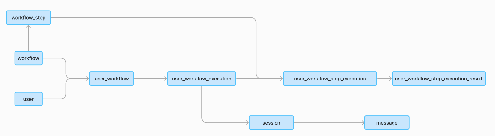

# Workflow Execution Workflow in Mojodex

This document provides an overview of the concept related to the workflow execution process in the Mojodex platform and describes the sequence of events that occur from the moment a user initiates a new workflow execution until the workflow is completed and the result is delivered.

## Main concepts

The workflow execution process involves several concepts matching database tables.

#### Workflow
- Workflow concept is fully described in [this doc](./whats_a_workflow.md). Basically, a worflow is a some complex process the assistant can help the user with. A workflow is fully configurable.

#### Workflow Step
- A `workflow_step` is a single step in a workflow. It is made of {input specification, execute method, output specification}. The execute method is the core of the step, it is where the step does its job. The input and output specification are used to validate the input and output of the step.
A step can be run multiple times in a workflow, with different inputs and outputs.

#### User Workflow
- Each user has its own set of workflows it can launch with Mojodex.  A `user_workflow` stands for the association between a user and a workflow.

#### User Workflow Execution
- A `user_workflow_execution` represents the instance of a workflow being executed by a user. It captures various details such as the start time and any relevant metadata pertaining to the execution of a specific workflow by a user.

> Note, sometimes refered as `workflow_execution` for short.

#### User Workflow Execution Step Execution
- A `user_workflow_execution_step_execution` represents the instance of a step being executed within a workflow execution. 

#### Session
- A `session` represents an interaction between the user and the assistant. It captures the messages exchanged between the user and the assistant, as well as the state of the conversation at any given time. A `user_workflow_execution` always needs a `session` for the user and its assistant to co-work on the workflow.

#### Message
- A `message` represents a single message exchanged between the user and the assistant within a session. It captures the content of the message, sender, timestamp of the message, and other relevant metadata depeding on the type of message. In the database, a `json` field is used to store the content of the message, allowing high flexibility regarding stored data.




## Workflow execution workflow

The workflow execution workflow is a sequence of events that occur from the moment a user initiates a new workflow execution until the workflow is completed. The workflow is described below.

### 1. User Workflow Execution Creation
Creation of execution is done as soon as the user hits the card of the workflow they want to create.


This generates a call to PUT `/user_workflow_execution` to the backend (`backend/app/routes/user_workflow_execution.py`), specifying the `user_workflow` the user wants to execute.
This call creates a User Workflow Execution instance in the database and a `session` if not already exists (which is the case in current Mojodex implementations).

```python
from mojodex_core.entities import MdUserWorkflowExecution
[...]
class UserWorkflowExecution(Resource):
    [...]
    def put(self, user_id): 
        [...]
        session_creation = self.session_creator.create_session(user_id, platform, "form")
        [...]
        session_id = session_creation[0]["session_id"]
        [...]
        db_workflow_execution = MdUserWorkflowExecution(
                user_workflow_fk=user_workflow_pk,
                session_id=session_id,
                json_inputs=empty_json_input_values
            )
        db.session.add(db_workflow_execution)
        db.session.commit()
```

This call also returns a json representation of the workflow, including json_inputs_spec to display to the user in the interface so that user have the instructions to start. Those input fields are the one defined in [the workflows's json configuration file as `json_inputs_spec`](../../guides/tasks/task_spec.json).

```python
return {
           "workflow_name_for_user": "<workflow_name_for_user>",
           "workflow_definition_for_user": "<workflow_definition_for_user>",
           "user_workflow_execution_pk": < pk >,
"user_workflow_fk": < fk >,
"steps": [{
              "workflow_step_pk": < workflow_step_pk >,
          "step_name_for_user": "<step_name_for_user>",
"step_definition_for_user": "<step_definition_for_user>"
}, ...],
"validated_steps_executions": [step_execution.to_json() for step_execution in
                               self.past_accepted_steps_executions],
"session_id": < session_id >,
"inputs": < json_inputs >
}
```

### 2. User Workflow Execution Start
From those instructions, there are 2 ways to start the workflow:

#### 2.1. User Workflow Execution Start from filled form
This is the method used in the web interface. The user fills the form and submit it. This generates a call to POST `/user_workflow_execution` to the backend (`backend/app/routes/user_workflow_execution.py`), specifying the `user_workflow_execution_pk` received at previous step and the values of filled form.

Resource associated to the route updates the User Workflow Execution instance and instanciate a Python object WorkflowExecution.
Finally, it launches in a parallel thread the start of the workflow by running workflow.`run` method.


```python
[...]
class UserWorkflowExecution(Resource):
    [...]
    def post(self, user_id):
        [...]
        db_workflow_execution.json_inputs = json_inputs
        flag_modified(db_workflow_execution, "json_inputs")
        db_workflow_execution.start_date = datetime.now()
        db.session.commit()

        workflow_execution = WorkflowExecution(user_workflow_execution_pk)

        server_socket.start_background_task(workflow_execution.run)
        [...]
```

The `WorkflowExecution` is the epicenter of workflow execution. The function `run()` will:
- Determine what is the current step to run with what parameter and create the corresponding step execution object.
- Run current step
- Ask for user validation once the step is executed


> The Workflow Execution detailled flow is described in part 3.

#### 2.2. User Workflow Execution Start from user message
> TODO - NOT IMPLEMENTED YET

### 3. Workflow Execution
A Workflow Execution is a Python object that manages the execution of a workflow. It corresponds to a `user_workflow_execution` in the database.
It has a list of `WorkflowStepExecution` objects, one for each step of the workflow. The current step to run is determined by the _get_current_step() method.

The entry point of the workflow execution is the `run` method of the `WorkflowExecution` class. This method is called in a parallel thread when the user starts the workflow execution or when a step needs to be executed (because of user validation or because of a user instruction to re-execute).

```python
class WorkflowExecution:
    [...]
    def run(self):
        [...]
        if not self._get_current_step():
            return
        self._get_current_step().execute(self.initial_parameters, self._past_validated_steps_results, self.db_object.session_id)
        self._ask_for_validation()
    [...]
```

#### 3.1 Determining current_step
The _get_current_step() method determines the current step to run:


```python
class WorkflowExecution:
    [...]
    def _get_current_step(self):
        [...]
            if self._current_step: # if current step already determined, return it
                return self._current_step
            if not self.validated_steps_executions: # no step validated yet, start from first step
                self._current_step = self._generate_new_step_execution(self._db_workflow_steps[0], self.initial_parameters) # of first step
                return self._current_step
            
            last_validated_step_execution = self.validated_steps_executions[-1]
            
            if len(self.validated_steps_executions) > 1: # no dependency as it was the first step
                db_dependency_step = [...]
                # depency step is the workflow_step of step execution that created last_validated_step_execution inputs
                # It is the workflow_step ranked just before the last_validated_step_execution's workflow_step in the workflow
            
                # find last execution of dependency step
                db_dependency_step_execution = [...]
                
                # How many parameters have been executed and validated for last_validated_step_execution's workflow_step?
                current_step_executions_count = [...]
                
                # have all parameters resulting from db_dependency_step_execution been executed and validated?
                if current_step_executions_count < len(db_dependency_step_execution.result):
                    current_parameter = db_dependency_step_execution.result[current_step_executions_count]
                    self._current_step = self._generate_new_step_execution(last_validated_step_execution.workflow_step, current_parameter)
                    return self._current_step

            # else, generate new step execution of next step
            next_step = [...]
            if next_step is None:
                return None # end of workflow
            # else
            self._current_step=self._generate_new_step_execution(next_step, last_validated_step_execution.result[0])
            return self._current_step
            [...]
```

#### 3.3 Executing a step 
Executing a step consists in executing the step on a certain parameter as input.
A socketio message is sent to client before starting execution to update the client interface.

```python
class WorkflowExecution:
    [...]
    def execute(self, initial_parameter: dict, past_validated_steps_results: List[dict], session_id: str):
        [...]
            step_json = self.to_json()
            step_json["session_id"] = session_id
            server_socket.emit('workflow_step_execution_started', step_json, to=session_id)
            self.result = self.workflow_step.execute(self.parameter, self.get_learned_instructions(), initial_parameter, past_validated_steps_results)
        [...]
```

#### 3.4 Asking for validation
Once the step execution is done, the user is asked to validate the result. This is done by sending a socketio message to the client application:
```python
def _ask_for_validation(self):
        [...]
        step_execution_json = self._get_current_step().to_json()
        step_execution_json["session_id"] = self.db_object.session_id
        server_socket.emit('workflow_step_execution_ended', step_execution_json, to=self.db_object.session_id)
        [...]
```

### 4. User validation
#### 4.1. User validates
When the user validates the result of the run, the route POST `/user_workflow_execution_step_execution`is called with value `validated` set to `True`. This route updates the `user_workflow_execution_step_execution` instance in the database and triggers the next step execution with `workflow.run` in a dedicated thread.
```python
class UserWorkflowStepExecution(Resource):
    [...]
    def post(self, user_id):
        [...]
        workflow_execution = WorkflowExecution(user_workflow_execution.user_workflow_execution_pk)
        
        workflow_execution.validate_step_execution(user_workflow_step_execution_pk)
        server_socket.start_background_task(workflow_execution.run)
        [...]
```
            

