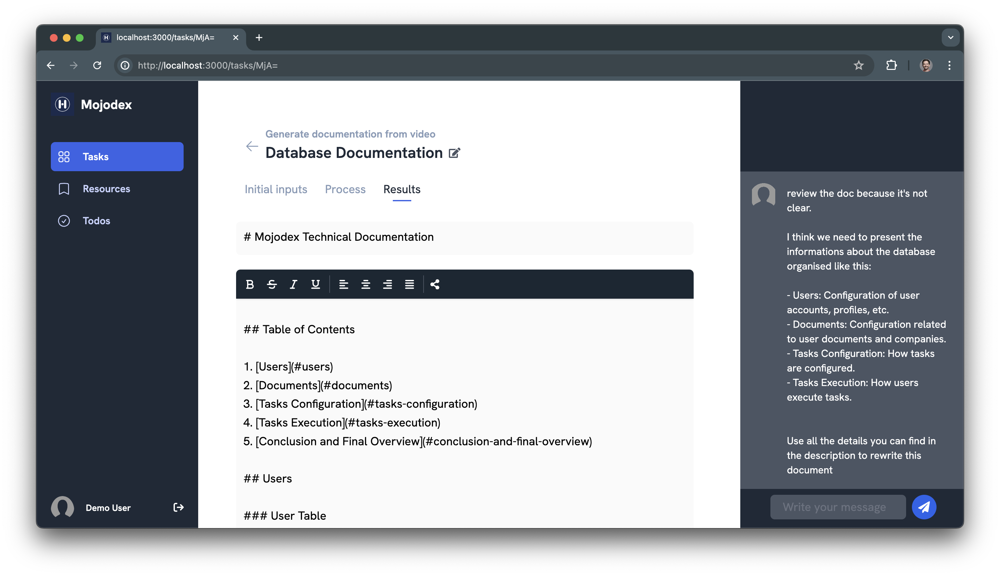
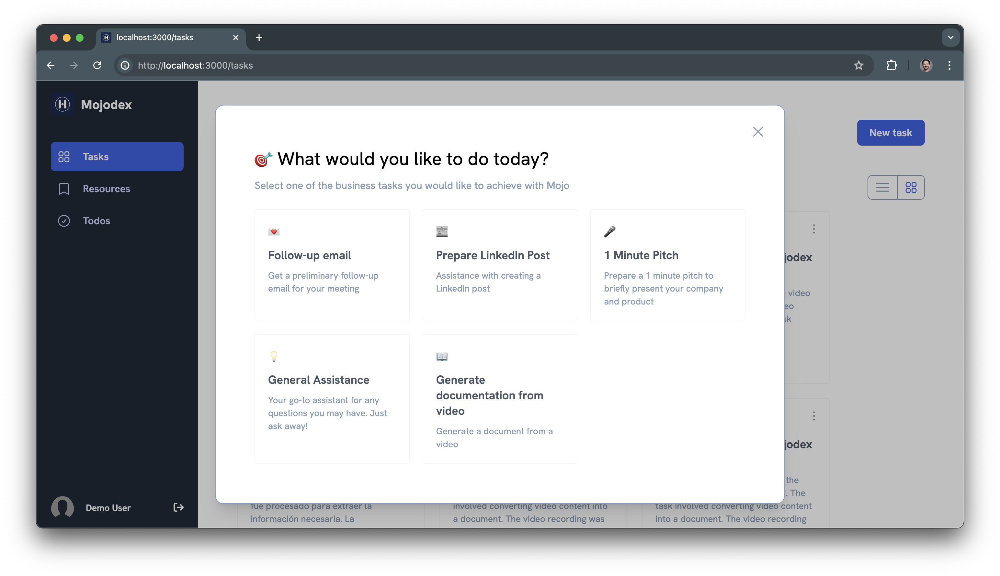
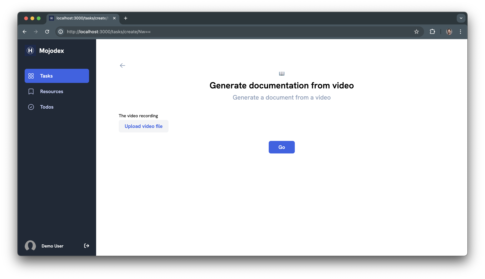
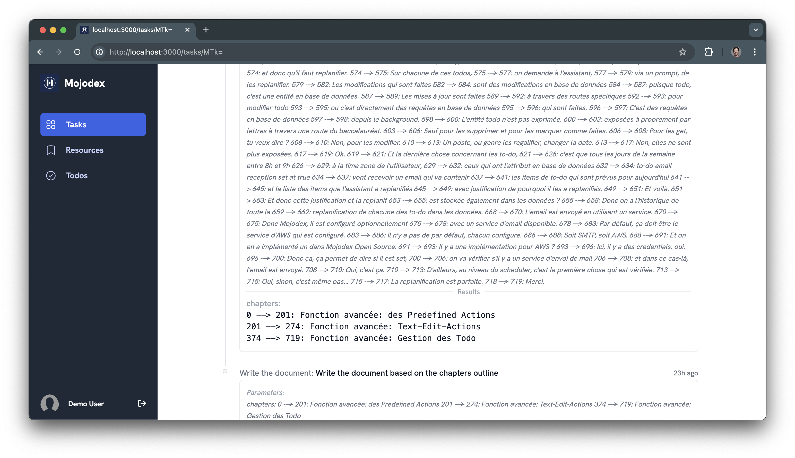

# What's a `worflow`?

It's a particular type of [`Task`](../tasks/whats_a_task.md).

*By the way, the `What's a task` page example is a workflow, actually.*

## What's different with an `instruct` task?

Workflows are tasks:

- composed of multiple steps
- orchestrated with code

As a consequence of these differences, developers can make more customized tasks, with more complex user interactions and more interoperability with other programs through APIs.

There are examples in the `mojodex_core/workflows/` directory.

## Differences between `instruct` and `workflow` tasks

| `instruct`                                                                                                                                      | `workflow`                                                                                                                                                                                                                                               |
| ----------------------------------------------------------------------------------------------------------------------------------------------- | -------------------------------------------------------------------------------------------------------------------------------------------------------------------------------------------------------------------------------------------------------- |
| Quick and direct task.                                                                                                                          | Step-by-step process.                                                                                                                                                                                                                                    |
| Made of a simple interaction = message exchanges, between the assistant and the user.                                                           | A step is code. Anything can be done in this code including complex actions as API calls.                                                                                                                                                                |
| Uses the same prompt template for every task.                                                                                                   | User can visualize and take action on each step results.                                                                                                                                                                                                 |
| Example: `Write a poem`: The user gives a subject and a number of stanzas and the poem is written straight-forward by conversation btw user and assistant. | Example: `Write a poem stanza by stanza`: The user gives a subject and a number of stanzas and the assistant writes 1 stanza, user can edit or ask for edition before moving on to the next one etc… API calls could also be done to enrich poem, associate images… |

## Usage

A user has access to the workflows in the same section as the new task creation:

Provide the first input required to launch the first step of the workflow

For each step, interact with your assistant depending on how it's been designed, here, we want the user to review and validate the chapters of the documentation

Once the final step of the workflow is done, the user has access to the result.

## How to create a `workflow`?

See the doc in [`guides/workflows/new_workflow.md`](../../guides/workflows/new_workflow.md)