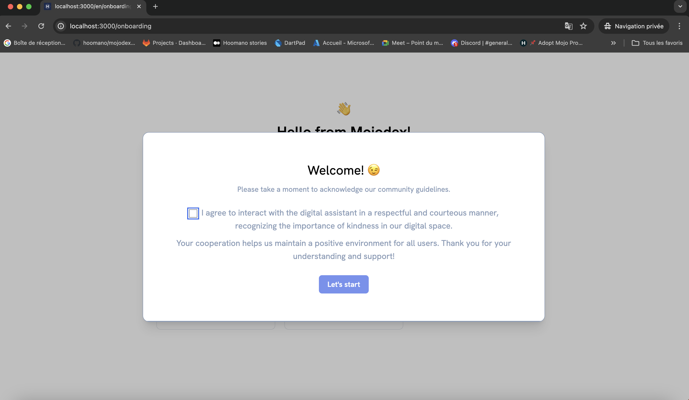
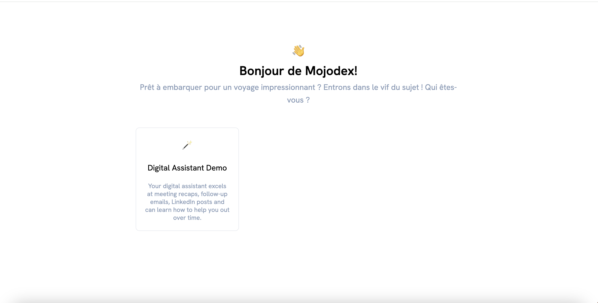
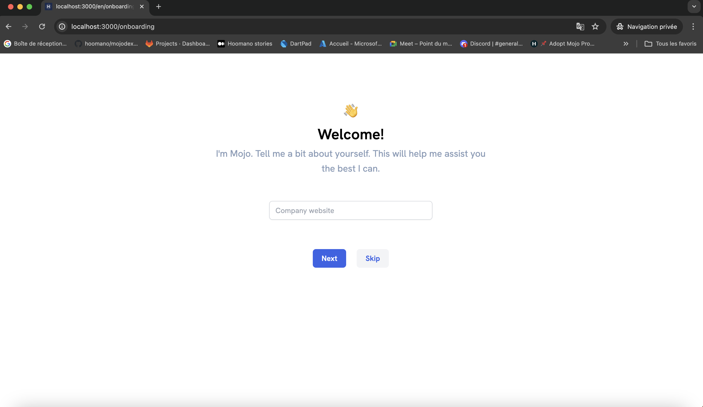

# Create a new user

There are 2 ways for new users to be created:
- Autonomous signup: The user creates an account on the platform using "Sign up" button.
- Admin creation: An admin creates an account for the user using administration route.

## Autonomous signup
When a user clicks the "sign up" button on Mojodex homepage, they are redirected to the sign up page. The user is asked to fill in the following information:
- name
- email
- password

Once the user has filled in the information, they click the "sign up" button and there are redirected to an onboarding process.

1. They have to accept the terms and conditions if provided, else accept to be respectful when adressing the assistant.


2. They have to choose a profile category. This will determine their profile and so the tasks they can access. (See `docs/design-principles/profiles/whats_a_profile.md`)


3. They can provide their company website for a more personalized experience. This step is optional.


Once they have completed the onboarding process, they are redirected to the dashboard. Their account is created and associated with a free product associated to the chosen category.

## Admin creation
An admin can create a new user account by using dedicated administration routes. Here is the process:

1. Create user account:
You can get helped by using the dedicated route so that GPT-4 generates a first json for you from your requirements.
```
curl --location --request PUT 'http://localhost:5001/user' \
--header 'Authorization: backoffice_secret' \
--header 'Content-Type: application/json' \
--data-raw '{"datetime": "2024-02-14T17:49:26.545180",
"name": "user_name",
"email": "user_email@email.com",
"password": "user_temporary_password",
"admin_creation": true
}'
```

2. Affect a role to the user:
```
curl --location --request PUT 'http://localhost:5001/role' \
--header 'Authorization: backoffice_secret' \
--header 'Content-Type: application/json' \
--data-raw '{"datetime": "2024-02-14T17:49:26.545180",
"profile_pk": 1,
"user_email": "user_email@email.com"
}'
```

Once this is done, the user can log in with the temporary password and will directly access the dashboard.
They can change their password using the "forget password" link on the login page.
> Note that this feature is available only if an email service has been set in configuration.