# Mojodex Technical Documentation

> What's this doc for? 
> **High level understanding of the architecture of Mojodex and the relationship between its components.**
> *More detailed documentation is available in each components directory.*

Mojodex is an open source tool, a platform for creating digital assistants. Designed around tasks, Mojodex enables developers and IT teams to create customised digital assistants for their staff in a simple way. The platform can be deployed in the cloud and works with both backend and frontend tools. Administrators can configure tasks for users, and there are several types of tasks and interfaces for using them. Mojodex allows companies to take ownership of the development of their AI tools.

## 1. Mojodex technical architecture

### Main components

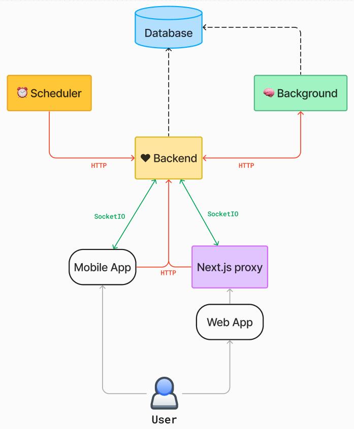

- **Mobile application**: Developed in Flutter, it accesses the Python backend directly.
- **Web application** : Developed in React, it accesses the Python backend via a Next.js proxy.
- **CLI**: Command-line tool for developers.
- **Backend** : Manages real-time interactions and REST APIs.
- **Background**: Manages long and proactive tasks.
- **Scheduler**: triggers tasks at given times.
- **PostgreSQL database with PGVector**: Stores data and embeddings.

### Communication flows

- **REST routes**: Used for HTTP communications, shown in red.
- **Socket.io streams**: Used for real-time communications, shown in green.

## 2. Backend component

The backend is a Python application implemented with Flask to manage REST APIs and business logic. It uses SQLAlchemy to access the database and Flask-SocketIO for real-time interactions.

### Routes and session management

Routes are defined in a `HTTPRouteManager` class. The backend uses a `db` object provided by Flask-SQLAlchemy for interactions with the database. A `@with_db_session` decorator is used to handle database sessions outside of route calls, to avoid database locks. Models are defined in `mojodex_core/entities/db_base_entities.py`

### Real-time interactions

The backend uses Flask-SocketIO to manage real-time interactions, in particular for chat between the user and the assistant. Messages are sent via Socket.io rooms, separated by session ID. Authentication of Socket.io flows is managed in the same way as Flask authentication, using tokens.

### Message management

Messages between the backend and the frontend are managed via Socket.io. Important messages, such as Mojo messages and draft messages, use acknowledgement mechanisms to ensure that they are received by the client.

## 3. Background component

The background is designed to manage long and proactive processes. It uses Flask to expose HTTP routes and a thread pool executor to launch processes in parallel. Processes are logged at admin level, and the background handles errors autonomously.

#### Features

Features implemented in the background include:
- Extracting and rescheduling to-dos.
- Creating and updating documents from a website.
- Event generation for push notifications and emails.

#### Database access

The background has access to the database via SQLAlchemy and also uses the `@with_db_session` decorator to manage database sessions outside of route calls.

### Thread management

The background runs processes in separate threads to avoid blocking the main Flask server. Process results are logged, and the background handles errors autonomously.

## 4. PostgreSQL database and PGVector

### Choice of PostgreSQL

PostgreSQL was chosen for its flexibility and its ability to manage vector columns via the PGVector extension. Tests were carried out with other vector databases, but PostgreSQL proved sufficient for the needs of Mojodex.

### Database schema

The database schema is available on DB Diagram. Table names are prefixed with `md_` for Mojodex. A `create-mojodex-data.sql` script creates the database schema, and an `init-mojodex-data.sql` script initializes the data.

> See section #23 for a high level overview of the database structure and organisation

> Also see detailed database documentation here: [https://dbdiagram.io/d/MojodexDatabase-659d0645ac844320ae85b440](https://dbdiagram.io/d/MojodexDatabase-659d0645ac844320ae85b440)

### Representing entities

Database entities are represented in Python classes generated by SQLacodegen. These classes can be overloaded to add specific attributes.

### Using JSON

Some columns in the database use the JSON type to retain flexibility on certain fields, such as the `message` field in the `md_message` table.

## 5. Scheduler
The Mojodex scheduler is designed to trigger actions at specific intervals. Currently, there is no implementation for triggering actions at a specific time of day. Actions are triggered according to the interval and the user's timezone.

### How the scheduler works
The scheduler uses the Python `schedule` module to execute tasks at a specific frequency. These tasks are implemented in the scheduler main, which usually runs in a simple Python container. The scheduler can call either the backend for administrative tasks (such as updating users whose purchases have expired), or the background for proactive actions (such as sending notifications or retrieving tasks).

## 6. Webapp
The web app gives users access to the Mojodex API. The front-end is developed in React and the proxy in Node.js. REST Flows pass through the proxy, while Socket.IO flows pass directly between the web app and the Python backend.

### User authentication
Users can be authenticated via login/password or via providers (Google, Apple...). The authentication request arrives on the Next server (Node.js), is rerouted to the Python backend for verification, and the authentication token is sent back to the client on the front end for future calls.

## 7. Deployment management
### 7.1 Local deployment
To deploy Mojodex locally, there are 2 Docker Composes: a classic one and one for development (`docker-compose-dev.yml`). Each Docker Compose contains six Docker containers corresponding to different project directories, each with its own Dockerfile.

- mojodex-db
- mojodex-backend
- mojodex-background
- mojodex-scheduler
- mojodex-webapp
- (optionnal) mojodex-ollama

#### Local deployment procedure
1. Clone the repo.
2. Copy and modify the `.env` file from `.env.example`.
3. Copy and modify the `.conf.example` files (models.conf, stt-models.conf, embeddings-models.conf).
4. Start the services with `docker-compose up -d --build`.
5. Access the web app on `localhost:3000` with the default user (email: demo@example.com, password: demo).

### 7.2 Deployment on Azure
Mojodex can be deployed on Azure using services such as Container Registry, App Services, Container Instances, Storage Account, and a Postgres database server in flexible mode.

#### Deployment procedure on Azure
1. Install Azure CLI and log in to Azure.
2. Update the template configuration files (.conf).
3. Use the `azure_deployment_script.sh` script to deploy services.
4. Restart the Azure services after deployment.
5. Access the web app via the URL provided by Azure.

> Caution: Note that this script is intended to be used more as a ‘memory aid’ than as a script to be run all at once without supervision.

!!! note  ""
    💡 For Azure users, you can find advanced deployment informations in the following resources:

    - [Deployment Guide with Azure](../../guides/azure-deployment.md)

## 8. Data management

### Data types
1. **Database**: Contains all the business data required to run Mojodex.
2. **User files**: Stored in the `/data` directory and organised by session.
3. **Datasets**: Files created to use the data generated by Mojodex, in particular LLM calls.
4. **Cost files** : Consumption logs to analyse the costs and usage of the various services.

### Data details
#### Database
- Stored locally in a Docker volume.
- In Azure mode, managed by the Azure Postgres server.

#### User files
- Stored in `/data/users/{user_id}/{session_id}`.
- Contain audio files, audio messages from the user, and uploaded images and videos.

#### Datasets
- Stored in `/data/prompt_datasets/{type}/{label}/{task_name}/{id}`.
- Contain LLM call parameters and generated responses.

#### Cost files
- Stored as CSV files.
- Contain information on consumption by user, task and service.

## 9. Differences Between Instruct Tasks and Workflows
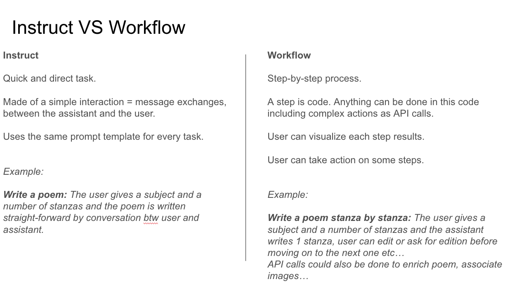

## 10. Task Creation

### Instruct Tasks

Instruct tasks are the simpler type of tasks in Mojodex. Here is the process to create an Instruct task:

1. **Identify Tasks**: Identify the tasks that need to be created based on the job profiles within the company.
2. **Post-Task JSON Route**: Use the `POST /task_json` route to generate a preliminary JSON definition of the task.
    - This route takes the task definition as a parameter and returns a JSON template.
    - Ensure to review and adapt the JSON to fit your specific needs.
3. **JSON Schema**: The JSON format and the route are detailed in the OpenAPI documentation.
4. **Put-Task Route**: Once the JSON is ready, send it via the `PUT /task` route to create the task in the database.
5. **SQL Script Alternative**: Alternatively, you can write an SQL script to create tasks directly in the database, which can be useful for multi-environment deployments.

### Workflow Tasks

Workflow tasks involve a more complex process:

1. **Create Workflow Directory**: In the `mojodex_core` module, under the `workflows` directory, create a new directory named after the workflow.
2. **Create Step Files**: For each step in the workflow, create a Python file named after the step.
    - Each file should contain a class that extends `WorkflowStep` and overrides the `_execute` method.
    - Ensure the input format of each step matches the output format of the previous step.
3. **Step Library**: Add each step to the `steps_library` file in the `mojodex_core/workflows` module, mapping step names to their corresponding classes.
4. **Workflow JSON**: Create a JSON definition for the workflow task, similar to Instruct tasks but including the steps with their names, descriptions, and order.
5. **Put-Task Route**: Send the workflow JSON via the `PUT /task` route.

> Creating a task does not make it available to users. It must be associated with a product through the `md_product_task_association` table.
> For more information on how to associate users to tasks, see section #2

## 11. Task Execution (`instruct`)

### 11.1 User Interaction

When a user wants to execute a task, the following steps occur:

1. **Task Selection**: The user clicks on "New Task" and sees a list of available tasks.
2. **Task Initiation**:
    - **Web App**: A form appears with fields that the user must fill out to start the task. These fields are mandatory.
    - **Mobile App**: The user sends an initial message, typically an audio message, containing all necessary inputs for the task.
3. **Task Execution**:
    - **Web App**: If all fields are filled correctly, the task starts immediately.
    - **Mobile App**: The assistant may ask follow-up questions to gather any missing information before starting the task.

### 11.2 Technical Description

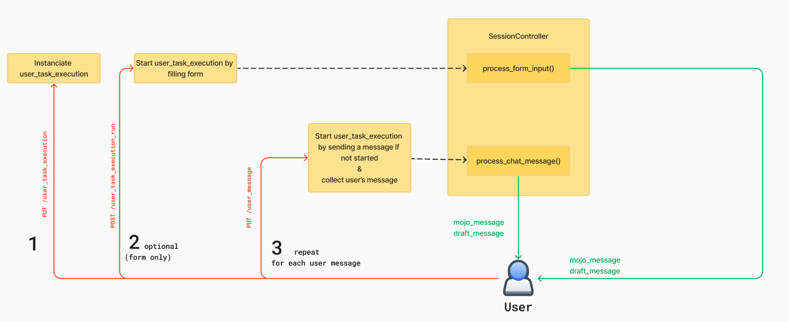

#### Step 1: Task Initialization

- **Route**: `PUT /user_task_execution`
- **Action**: Creates an instance of `UserTaskExecution` with a `JsonInput` field initialized with null values.
- **Details**:
    - A user is associated with multiple `UserTasks`.
    - When a user starts a task, a new `UserTaskExecution` object is created.
    - This route is called before any user inputs are provided.

#### Step 2: Form Submission (Web App Only)

- **Route**: `POST /user_task_execution_run`
- **Action**: Sets the start date of the `UserTaskExecution` and begins generating a response from the assistant.
- **Details**:
    - The `SessionController` handles chat exchanges and processes form inputs to generate the assistant's response.

#### Step 3: Message Handling (Mobile App)

- **Route**: `PUT /user_message`
- **Action**: Sends a user message and ensures the associated `UserTaskExecution` is started.
- **Details**:
    - The route verifies if the `UserTaskExecution` is started; if not, it starts it.
    - Manages speech-to-text conversion and handles potential timeouts or crashes.
    - Uses a frontend-managed message ID to re-query the route in case of crash that would let the route to answer without providing `message_pk`.

#### Data Storage

- **Initial User Inputs**: Stored in the `UserTaskExecution` table under `JsonInputValues`.
- **Messages**: Stored in the `md_message` table in a JSON field.
- **Produced Text Versions**: Stored in the `md_produced_text_version` table, containing titles and bodies of each version.

## 12. Task Execution (`workflow`)

### 121.1 User Interaction

1. **Task Selection**: The user clicks on "New Task" and sees a list of available tasks.
2. **Task Initiation**: The user selects a workflow task and fills out the form.
3. **Workflow Execution**:
    - The user is presented with a process tab detailing each step of the workflow.
    - Steps can start and complete, with the user receiving updates via Socket.io events.
    - Some steps may require user validation before proceeding to the next step.
    - The user can interact with the assistant through buttons like `restart`, `edit`, and `review`.

### 12.2 Technical Description

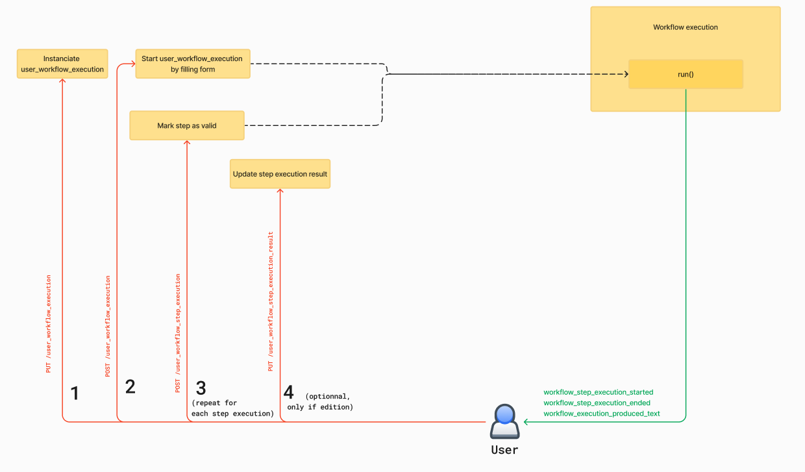

#### Step 1: Task Initialization

- **Route**: `PUT /user_task_execution`
- **Action**: Creates an instance of `UserTaskExecution` with a `json_input` field initialized with null values.
- **Details**:
    - Similar to `instruct` tasks, a new `UserTaskExecution` object is created when a user starts a task.

#### Step 2: Form Submission

- **Route**: `POST /user_task_execution_run`
- **Action**: Sets the start date of the `UserTaskExecution` and begins generating a response from the assistant.
- **Details**:
    - The `SessionController` handles chat exchanges and processes form inputs to generate the assistant's response.

#### Step 3: Step Execution

- **Socket.io Events**: Used to update the web app when a step starts or completes.
- **User Validation**: Some steps require user validation, defined by a database field associated with the workflow step.
- **Buttons**:
    - `restart`: Available only on the first step to modify initial inputs and relaunch the workflow.
    - `edit`: Allows the user to modify the step result directly before validating it.
    - `review`: Opens a chat for the user to send instructions to the assistant to re-execute the step.

#### Data Storage

- **Initial User Inputs**: Stored in the `UserTaskExecution` table under `json_input_values`.
- **Messages**: Stored in the `md_message` table in a JSON field.
- **Produced Text Versions**: Stored in the `md_produced_text_version` table, containing titles and bodies of each version.
- **File Storage**: Images and audio files are stored using the `UserFileStorageManager` in the volume data, identified by session and user.

#### Workflow Specifics

- **Step Validation**: Each step can be validated by the user before moving to the next step.
- **Final Produced Text**: Generated from the last step or concatenation of the last steps, with optional chat enabled based on a database field.

### 12.3 Workflow Execution: Method `run()`

When a user initiates a workflow, the following sequence of events occurs:

1. **Task Initialization**:
    - The user clicks on the task they want to execute.
    - The `PUT /user_task_execution` route is called to instantiate a new `UserTaskExecution`.

2. **Form Submission**:
    - After filling out the form and clicking "Go", the `PUT /user_task_execution_run` route is called.
    - This starts the workflow execution in a parallel thread.

3. **Workflow Execution**:
    - In the parallel thread, the `WorkflowProcessController` method `run` is invoked.
    - The `run` method determines the step to execute and executes it.

4. **Step Execution**:
    - If the step does not require user validation, the `run` method is called again to calculate and execute the next step.
    - If user validation is required, information is sent via `Socket.io` to the front end, indicating that user validation is needed.

5. **User Interaction**:
    - If the user is online, they receive a live notification.
    - If the user is offline, they can see the pending validation the next time they log in.

6. **Step Validation**:
    - The user can either validate the step or edit the result.
    - Validation calls the `POST /user_workflow_step_execution` route, marking the step as valid and re-invoking the `run` method.
    - Editing calls the `PUT /user_workflow_step_execution_result` route, updating the step result and re-invoking the `run` method.

#### Detailed Execution Flow

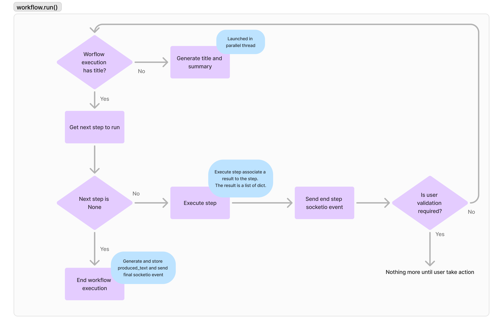

- The `run` method identifies the current step, executes it, and produces a result.
- If the workflow execution has no title, it generates the title and summary in a parallel process.
- The method retrieves the step to execute. If the step is `null`, the workflow is complete, and the final result is generated.
- If the step is not `null`, it executes the step, generates a result, and sends an event indicating the step completion.
- Depending on whether user validation is required, the `run` method is called again or waits for user input.

### 12.4 Determining the Next Step

#### Step Determination Logic

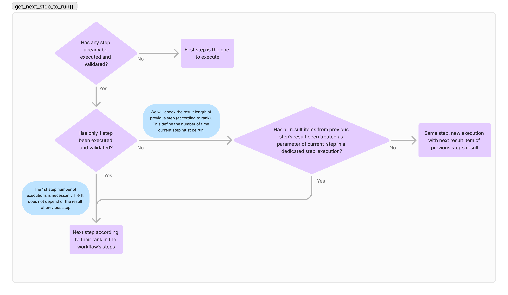

1. **Initial Step**:
    - If no step has been executed, the first step is executed.

2. **Subsequent Steps**:
    - If one step has been executed, the next step is determined based on its rank.
    - If multiple steps have been executed, the number of items in the result list of the previous step is checked.
    - The next step is executed for each item in the result list until all items are processed.

#### Example: Poem Workflow
- **Step 1**: User inputs the poem subject and number of stanzas.
- **Step 2**: Generates subjects for each stanza.
- **Step 3**: Writes each stanza based on the generated subjects.
- The `run` method iterates through these steps, ensuring each step is executed the required number of times based on the results of the previous step.

### 12.5 Chat and Step Validation

#### Chat on Step Validation
- If a step result is unsatisfactory, the user can initiate a chat by clicking "Review".
- The `user_workflow_step_execution` route is called with `validated=false`.
- A "snapshot" of the workflow (= parameter and result of each past steps) is taken and stored in a system message.
- The user interacts with the assistant to provide instructions for improving the step result.
- The step is re-executed with the new instructions.

#### Chat on Workflow Result
- At the end of the workflow, a snapshot of the entire workflow is taken and stored in a system message.
- If the user requests modifications to the final result, the assistant uses the context from the system message to make the necessary changes.

## 13. SessionController Chat Functionality

### Chat on Instruct Tasks and Workflows

#### Instruct Tasks
- **Chat on Result**: Users can send instructions about the final result of an instruct task.

#### Workflows
- **Chat on Steps**: Users can send instructions about individual steps if enabled.
- **Chat on Result**: Users can send instructions about the final result of the workflow.
- **API Call Considerations**: API calls cannot be repeated once the result is generated, enabling chat on workflow result could misguide users of hallucinated further API calls that would never happen.

### Entry Points

The `SessionController` has two main entry points for handling chat interactions:

1. **process_form_input()**: Called when the user clicks on "Go" on the WebApp in a parallel process by the route `POST /user_task_execution_run`.
2. **process_chat_message()**: Called when a message is received from the user via the `PUT /user_message` route.

### `@user_input_processor` Decorator

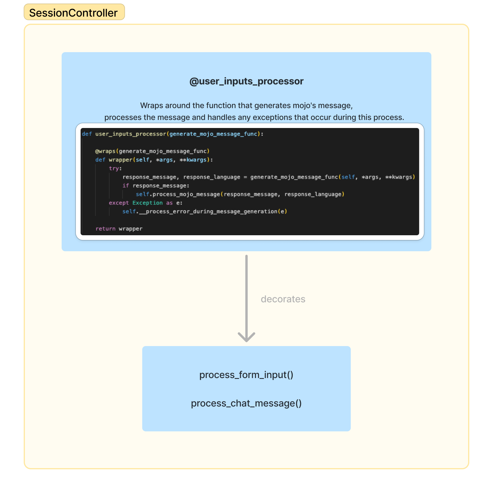

Both entry points are decorated with the `@user_input_processor` decorator. This decorator ensures that the functions will call a `ChatAssistant`, return a `response_message`, and handle adding the response to the database and streaming it.

### Differences between those methods

- **process_form_input()**: This method is specific to instruct tasks and cannot be called outside the context of an instruct task.
- **process_chat_message()**: This method can be called in various contexts, including outside of a task, such as in the Home Chat context, or in workflow execution context. It includes additional checks to determine the context and handle it accordingly.

## 14. Chat Assistant Functionality

#### ChatAssistant Classes

The `ChatAssistant` is an abstract class responsible for generating assistant responses. It has three implementations:

1. **HomeChatAssistant**
2. **InstructTaskAssistant**
3. **WorkflowAssistant**

#### Common Methods

The `ChatAssistant` class defines several common methods:

- **_call_llm()**: Makes a call to the language model.
- **_handle_llm_output()**: Handles the output from the language model, including extracting the language and tags.

#### Abstract Methods

Each `ChatAssistant` implementation must override the following abstract methods:

- **generate_message()**: Generates the message specific to the assistant.
- **mpt()**: A property that returns the MPT (Mojodex Prompt Template) specific to the assistant.
- **_manage_response_tag()**: Manages the response tags specific to the assistant.
- **_token_callback()**: Handles the callback for tokens, which can vary between assistants.

### 14.1 HomeChatAssistant

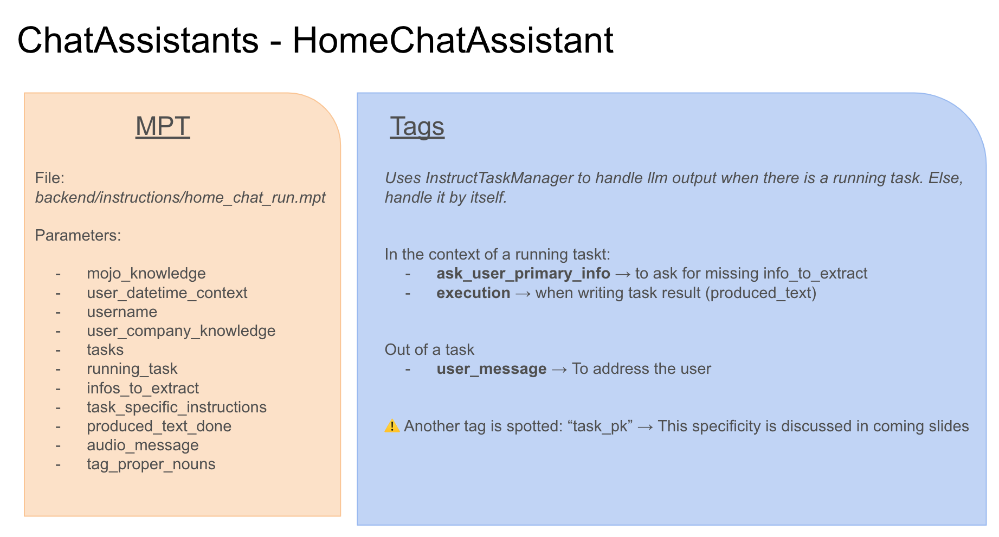

### 14.2 Instruct Task Assistant

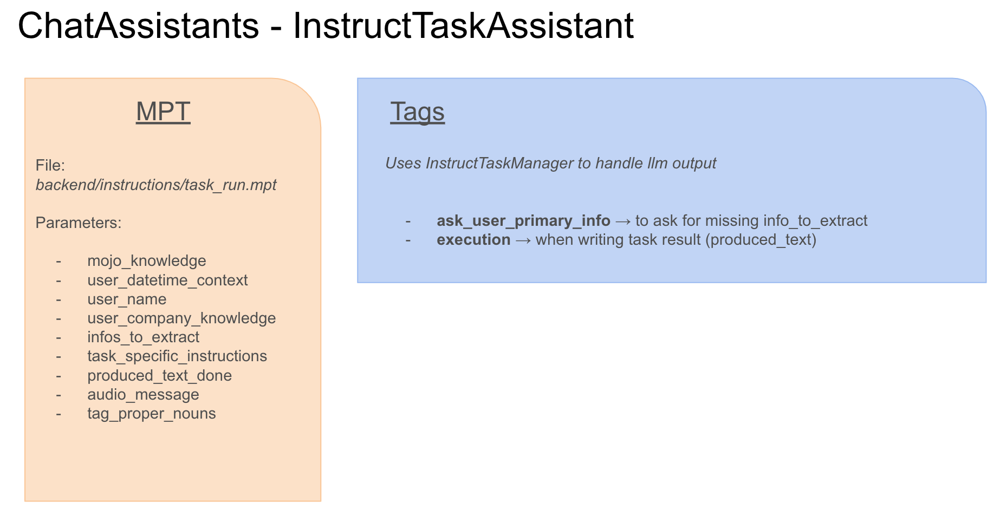

### 14.3 Workflow Assistant

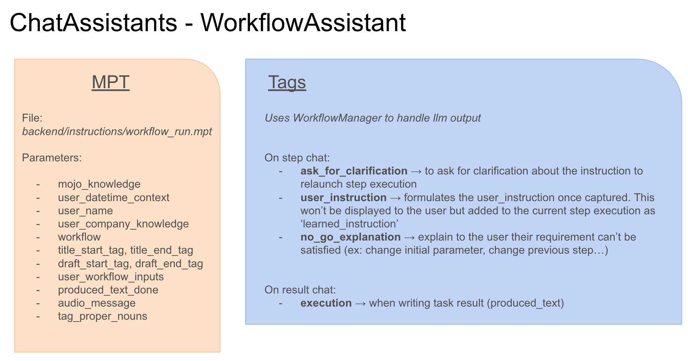

## 15. Home Chat Functionality

### Overview
The Home Chat Assistant is a feature implemented in the mobile app but is currently not in active use. It is present in the main branch of the mobile app but has not been fully tested and lacks a defined use case.

### Session Initialization
When a user navigates to the Home Chat page, a session is initiated, allowing the user to exchange messages with the assistant without selecting or starting any specific user task.

### Task Execution
- The assistant can start an instruct task at any moment based on the user's natural conversation.
- For example, if a user mentions wanting to post on LinkedIn, the assistant can initiate the task to write a LinkedIn post.

### Maintaining Task Execution Consistency
- The goal is to maintain consistency between tasks started by user clicks and those initiated by the assistant.
- This is managed by detecting during the assistant's response streaming (in the `_token_callback` function) whether a task has been started.

### Token Callback  `_token_callback` Function
- The partially generated text is analyzed to check for `<task_pk>` and `</task_pk>` tags on the fly.
- If these tags are detected, the value between them is extracted to determine the task context.
- If a `task_pk` is present, it indicates a task context; otherwise, it does not.

### Task Decision Process
- If the assistant decides to start a task, it begins its response with `<task_pk>`, the task number, and `</task_pk>`. i.e. `<task_pk>12</task_pk>`
- The assistant has access to the list of tasks available to the user, including their PKs.
- The function checks if the tags are detected and processes accordingly:
  - If `task_pk` is `null` and no task is running, the assistant continues with a general message.
  - If `task_pk` is `null` but a task was running, it indicates the task has ended, and the running task is set to `false`.
  - If a `task_pk` is detected and no task is running, it signals the start of a new task, and the function returns, stopping further token processing.

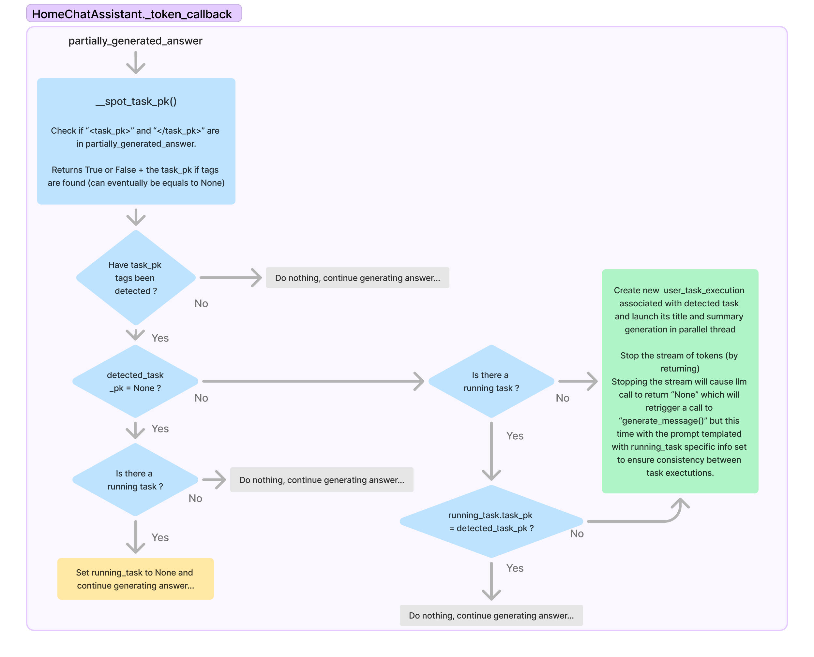

### Implementation Details
- The assistant's context changes when a task is running, affecting the prompt's templating.
- This way, by stopping the answer generation and adapting the prompt when a task starts, the prompt used to start a task by the assistant will be consistent with the one used when a user clicks to start a task. This ensures that both ways of initializing a task are using the same execution conditions.
- The assistant can switch tasks based on user instructions, maintaining flexibility in task management.

## 16. Proper Nouns Resolution with Mojodex

### Overview
Proper noun resolution is crucial for improving user experience, especially in audio chats where correcting names repeatedly can be frustrating.

### Tagging Proper Nouns
- Proper nouns are tagged in both assistant messages and user messages.
- For assistant messages, tagging proper nouns instruction is added directly in the prompt for mobile app users.
- For user messages, after transcription, the `POST /vocabulary` route is called to tag proper nouns.

### Vocabulary Management
- When a user corrects a proper noun, the `PUT /vocabulary` route updates the spelling in all current session messages, task titles and summaries, produced_text last version.
- The corrected word is added to the user's vocabulary table if it doesn't already exist.

### Whisper Integration
- Whisper, the speech-to-text model, is used to transcribe audio messages.
- Due to Whisper API limitation, only the most recent 20 words from the user's vocabulary are passed to Whisper as prompt to improve transcription accuracy.

### Future Improvements
- The system may need to handle a large number of proper nouns over time, requiring an algorithm to manage context-specific information.
- The approach may change if a different speech-to-text model is used in the future, or Whisper API changes.

## 17. Placeholders Functionality

### Overview
Placeholders were introduced to help developers avoid excessive token consumption during development, especially when testing UI elements.

> Note: the recent raise of strong small language models that can run locally may lead to avoid using this feature, as it dramatically changes the overall behavior of the platform.

### Usage in InstructTaskAssistant
- Placeholders are used to simulate responses without calling the LLM.
- In the `PUT /user_message` route, setting `use_message_placeholder` to `true` returns a "Hello World" response.
- Setting `use_draft_placeholder` to `true` returns a fake produced_text (draft message).

### Usage and Limitations in WorkflowAssistant
- WorkflowTasks can generate various message types, making the current placeholder system less effective.
- Currently, placeholders can simulate `<ask_for_clarification>` and produced_text (draft message) but not other types like `<user_instruction>`.

### Usage and Limitations in HomeChatAssistant
- For the Home Chat Assistant, setting `use_message_placeholder` to `true` returns a "Hello World" message.
- Other types of messages can't be simulated using placeholders.

### Future Considerations
- The need for placeholders may decrease with the availability of powerful open-source LLMs for local development.
- For WorkflowTasks, creating specific test data might be more practical than implementing a complex placeholder mechanism.

## 18. Document Management

### Overview
The document management system in Mojodex was designed with future functionalities in mind, particularly for Retrieval-Augmented Generation (RAG), although RAG is not currently implemented. The system is equipped to handle documents and is integrated into the Mojodex web application.

### Web App Integration
In the Mojodex web application, there is a "Resources" tab where users can add documents they wish to save. These documents can later be utilized in various Mojodex functionalities. Currently, users can only add web pages as documents. During the onboarding process, users have the option to add their company's website, which is then transformed into a user document.

> When dealing with tasks that require file inputs, the files are stored in the session for task execution and are not added to the document storage. The primary purpose of storing documents is to allow the assistant to dynamically use them to add contextual information during task execution or in a chat.

### Document Processing
To transform a website into a document, the user provides a URL. The system then fetches all links related to the provided URL, up to a maximum of 100 links. Each of these URLs is scraped for its HTML content, which is then treated as a text document. The system only processes links directly related to the initial URL and does not follow links within those links.

### Chunking Strategy
The document service in Mojodex Core, a singleton service, handles the addition of new documents through the `add_new_document()` method. This method naively chunks the document text based on token count, punctuation, and new lines. The chunking strategy is simple and may not be optimal for all use cases. The current method does not overlap chunks, meaning each character belongs to only one chunk.

### Embedding and Storage
Once the text is split into chunks, each chunk is embedded and stored in the `md_document_chunk` table in the database. Each chunk is stored with its text, its order within the document, and its vector. The order is used to concatenate and recreate the document in the correct sequence for the user.

### Document Retrieval
Although not currently used, the document service includes a method to retrieve documents based on vector distance calculations. This method takes a query, embeds it to form a vector, and uses the pgVector `cosine_distance()` method to find the nearest neighbors to the query. These nearest neighbors can then be used for various functionalities.

## 19. Mojodex Advanced Features: Predefined Actions

### Overview
Predefined Actions in Mojodex allow for chaining Task Executions. This feature is currently available only on the mobile app. It enables the execution of a subsequent task using the result of the previous task, maintaining the same context.

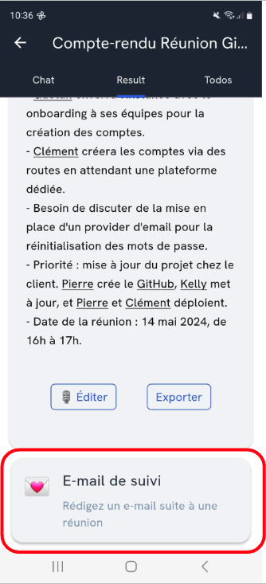

### Implementation Details
- **Task Association**: Tasks that can be chained are defined at the task level. There is an association table called `md_task_predefined_action_association` that links two tasks.
- **User Task Execution**: When a user clicks on a predefined action, it triggers the creation and execution of a new User Task Execution. The user message for this new task is prefixed with a message defined in the Predefined Action, followed by the result of the previous User Task.
- **Tracking Chain**: Each User Task Execution that is launched from another task can be traced back using the attribute `predefined_action_from_user_task_execution_fk`, which indicates the originating task.

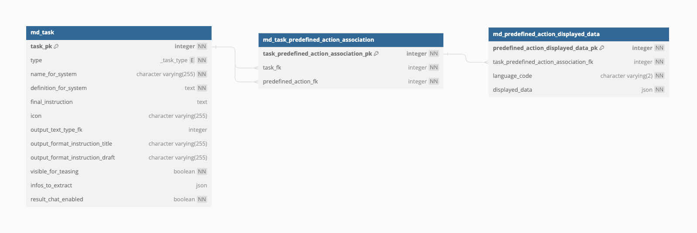

### Developer Instructions
1. **Creating a Predefined Action**:
   - First, create the subsequent task.
   - Then, establish the association between the tasks. This can be done during the creation or editing of a task.
   - Example: After a meeting summary, a follow-up email can be automatically triggered.

### Common Use Case
- **Meeting Minutes Predefined action**: After a meeting, it is common to send a follow-up email. This feature allows for the automatic chaining of these tasks.

## 20. Mojodex Advanced Features: Text-Edit Actions

### Overview
Text-Edit Actions are shortcuts for editing the output of a task without sending a chat message. This feature is also currently available only on the mobile app and helps users discover the editing capabilities of Mojodex.

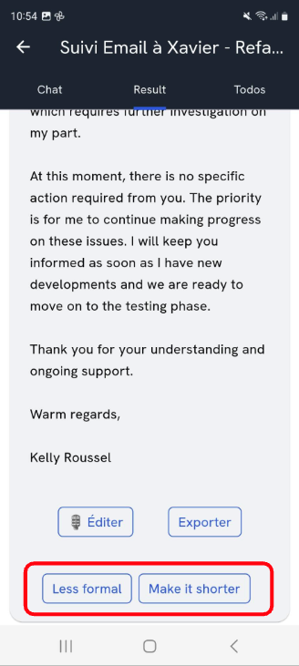

### Implementation Details
- **Text-Type Association**: Text-Edit Actions are defined at the text-type level. Each task output is associated with a text-type (e.g., document, email).
- **User Interaction**: When a user clicks on a Text-Edit Action, it generates a user message in the chat, which is then processed by calling the `text_edit_action` route instead of the classic `user_message` route.
- **Prompt Storage**: The prompt for each Text-Edit Action is stored in a file, and the path to this file is stored in the database. The file itself is typically a `.txt` file and is stored in `mojodex_core`.

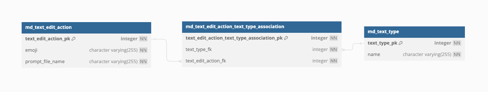

### Developer Instructions
1. **Defining Text-Edit Actions**:
   - Associate the Text-Edit Actions with a text-type.
   - Ensure that the prompt files are correctly stored and referenced in the database.

### Common Use Case
- **Email Editing**: Users can quickly make an email less formal or shorter by using predefined Text-Edit Actions.

## 21. Mojodex Advanced Features: Todo Management

### Overview
Todo Management in Mojodex involves the extraction and scheduling of ToDo items based on user task executions. This process runs in the background and helps users keep track of their tasks.

### Implementation Details
- **Todo Extraction**:
  - Every 10 minutes, a scheduler triggers the extraction of todos from user task executions whose latest `md_produced_text_version` is between 10 and 20 minutes old.
  - The assistant extracts actionable items mentioned by the user and adds them to the todo list, scheduling them for future dates.
- **Todo List Access**:
  - Users can view their todo list in the todo tab of the mobile or web app, or directly from a user task execution.
- **Todo Execution**:
  - Todos can be marked as done or deleted by the user.
  - Replanning of todos is done by the assistant every hour for todos that are overdue.

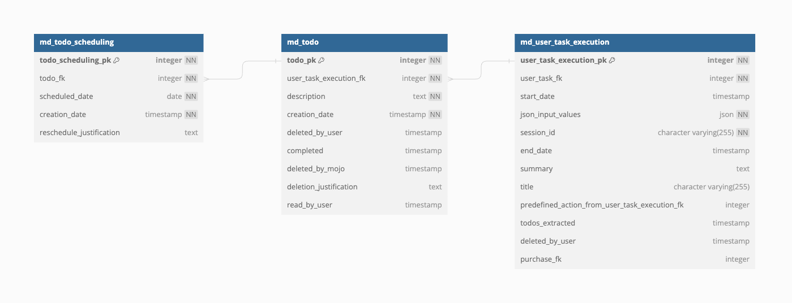

### Features
1. **Background Extraction**:
   - The scheduler is set to run every 10 minutes to extract todos.
   - The assistant is prompted to extract and reformulate todos from user task executions - only ToDo items explicitely mentioned as so by user.
2. **Todo Replanning**:
   - The scheduler runs every hour to replan overdue todos.
   - The assistant replans these todos and updates the database accordingly.
3. **Email Notifications**:
   - Users with the attribute `todo_email_reception` set at true receive a daily email between 8 AM and 9 AM (weekdays only) with their todos for the day and any replanifications.
   - The email service can be configured using SMTP or AWS.

### Common Use Case
- **Meeting Follow-up Actions**: Extracting follow-up actions from meeting summaries and adding them to the todo list.

## 22. Administration and Configuration of the platform

The goal of this section is to describe how to prepare and configure the Mojodex platform with *users*, *tasks* and *how tasks are made usable by users*

### 22.1 User Creation

There are two methods to create a new user:

1. **User Self-Registration**:
    - The user visits the web or mobile app and clicks on `Sign Up`.
    - They fill out a form with their name, email, and password.
    - After signing up, they go through an onboarding process:
        1. Accept Terms and Conditions.
        2. Choose a profile category, which determines the tasks they can access.
        3. Optionally, enter their company's website for additional context.
    - The user's account is created and associated with a free trial product of the chosen category. 
  `Note: a free trial is particular product that is limited wether in terms of days of use or number of tasks to run AND it's free, i.e. product.is_free = true`

2. **Admin-Created User**:
    - An admin calls the `PUT /user` route with the `skip_user_validation=true` parameter. Terms and conditions are "validated" by default, onboarding is skipped.
    - The user receives an email to change their default password.
    - The admin must assign a role or purchase to the user to grant access to tasks.

### 22.2 Product and Profile Management

Products and profiles in Mojodex are used to group tasks and manage user access:

1. **Product**:
    - A product is a collection of tasks associated with a specific user profile.
    - Products are grouped into categories (e.g., recruiters, engineers).
    - Each product can have different task lists tailored to specific job (e.g., managers, interns).

2. **Profile**:
`Products` and `Profiles` are represented with the same DB object: `md_product`.
`Profile` is a specialized representation of the `product` concept, better adapted to “admin all set config” where user has no control over the tasks they can access. A profile is:
- free
- has no limit
- has no Stripe ID

3. **Subscription**:
`Products` and `Subscription` are represented with the same DB object: `md_product`.
A `Subscription` is a particular type of product that has no limit in terms of number of tasks run and duration.

### 22.3 Purchase and Role Management

Purchases and roles link users to products and profiles:

1. **Purchase**:
    - A purchase is the association between a user and a product.
    - When a user makes a new purchase, their task access is updated.

2. **Role**:
`Purchases` and `Roles` are represented with the same DB object: `md_purchase`.
Role is better adapted to “admin all set config” where user has no control over the tasks they can access.
A `role` is making the relationship between a `user` and a `profile` which is a special `product` (as seen in the previous section).

### 22.4 Purchase and Subscription Management

A user can't have 2 active purchases of a `Subscription` at the same time.
When purchasing a subscription, if user already has a `Subscription` purchase, this one will be deactivated before adding the new `purchase`.

### 22.5 Database Entities Relationship

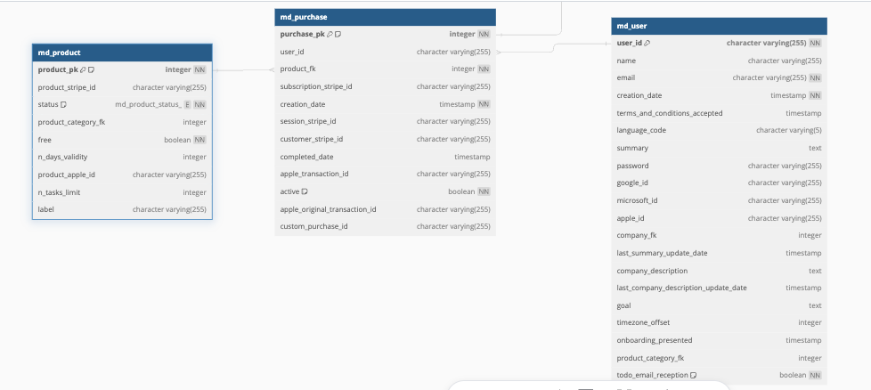

### 22.6 Procedure to create a new Product

**Creating a New Product**:
1. Create a product category: `PUT /product_category`
2. Within the category, create products for different user types: `PUT /product` (or `PUT /profile`)
3. Associate tasks with each product: `PUT /product_task_association`
4. Link users to products via purchases. `PUT /manual_purchase` (or `PUT /role`)

Each operation can be done using the appropriate backend routes.

## 23. Overview of Mojodex DB Tables

Mojodex's database is composed of several tables, each serving a specific purpose. The main categories of tables include:

- **Users**: Configuration of user accounts, profiles, etc.
- **Documents**: Configuration related to user documents and companies.
- **Tasks Configuration**: How tasks are configured.
- **Tasks Execution**: How users execute tasks.

Access to the database documentation:
- https://dbdiagram.io/d/MojodexDatabase-659d0645ac844320ae85b440
- https://dbdocs.io/kelly.roussel/Mojodex

### 23.1 Users

#### User Table

The User table is the central table in Mojodex. It contains essential elements for user identification, configuration data, authentication information, foreign keys to configuration tables, company information, time zones, and links to product categories. The product category determines the list of products that can be purchased by the user.

#### Product and Category Configuration

Before adding users, products and categories must be configured. This involves defining categories (*i.e recruitement*) for a given deployment, then creating associated products (*i.e manager*). 
Note: Each product category defines an implicit goal for the user, providing additional context for task execution.

#### Purchase and Payment Systems

A Purchase links a user to a product, validating their access. Mojodex, designed as a SaaS product, integrates with Stripe payment system. It also supports custom B2B relationships, allowing for invoice validation through a custom Purchase ID.

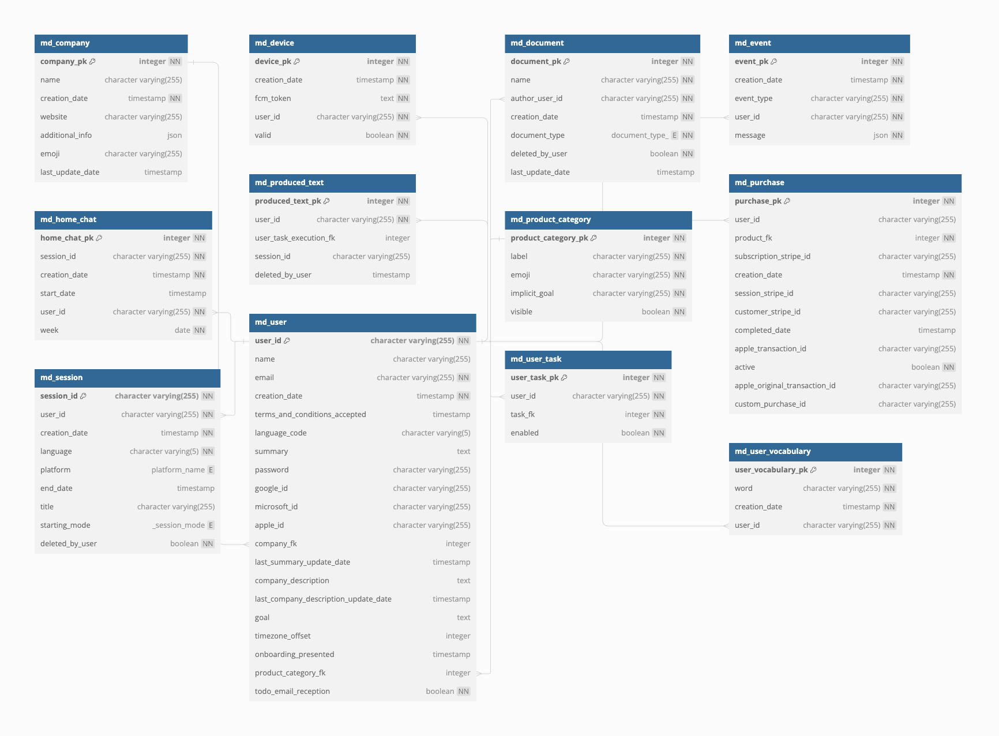

### 23.2 Documents

#### Display Data

Display data stores translation information, which is practical for backend flexibility despite adding some load to the database structure.

#### User Documents

Users are linked to documents like websites. These documents provide context information for task execution.

#### Vocabulary

User vocabulary stores proper names used by the user, enhancing the assistant's recognition capabilities. 

#### Events Management

Events log notifications sent to users, including emails and push notifications.

#### Devices and Notifications Management

The Device table stores Firebase Messaging tokens for user devices, ensuring notifications are sent to all valid devices. Invalid tokens are marked as such to maintain accuracy.

> Note: with this representation, if a user has multiple accounts on the same device, all notifications of all accounts will be sent to this device

### 23.3 Tasks Configuration

#### Task

Tasks are the core of Mojodex, divided into two types: Instruct and Workflow – but same table `md_task`. Task configuration includes defining task types, names, system definitions, display information, output formats, and more. Tasks are associated with platforms (e.g., mobile, web) to control their availability.

#### Product Tasks

Product Tasks link products to tasks, determining the list of tasks available for a given product.

#### Workflow and Steps 

Workflows consist of ordered steps defined in the `md_workflow_step` table. Each step includes information to process the workflow.

#### Actions

Tasks can have predefined actions linking them to other tasks, enabling task chaining. For example, after a meeting summary, a follow-up email task can be triggered.

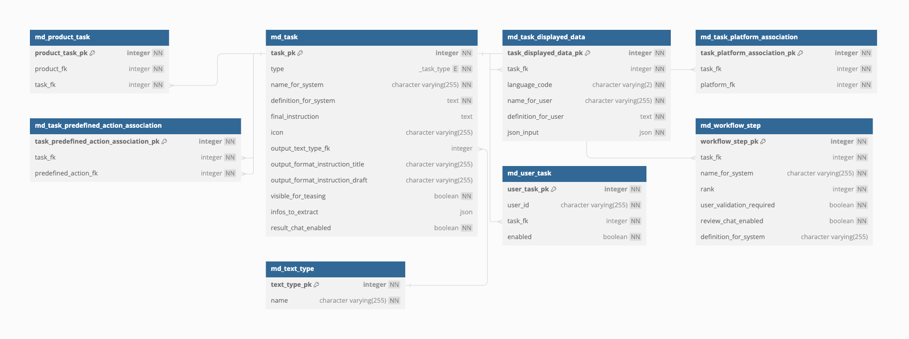

### 23.4 Tasks Executions

#### Task Execution and Sessions

Task execution involves the UserTaskExecution table, which links to user tasks, sessions, and purchases. Sessions manage all exchanges during task execution, including messages between the user and the assistant.

#### Inputs and Messages 

Users can start tasks via forms or messages. Form inputs are stored in `user_task_execution.json_input.values`, while message-based inputs are managed through message exchanges. 

> Note for message-based execution: at the start of a task AND even in the context of a chat over an already existing user_task_execution, inputs are not re-extracted but concatenated in the run task template, as conversation history.

#### Task Results and Produced Text Versions

Task execution results are stored in ProducedTextVersion, with multiple versions possible due to user edits or text-edit actions. The most recent version is considered the final result.

#### ToDos

ToDos are extracted at the end of a UserTaskExecution and can have various statuses (e.g., completed, pending, deleted). They are associated with a schedule, which can be adjusted over time.

#### Home Chat Interactions

The Home Chat table manages chat interactions not necessarly linked to specific tasks, maintaining context for a week. This allows users to chat with an assistant about various topics, with interactions stored in sessions.

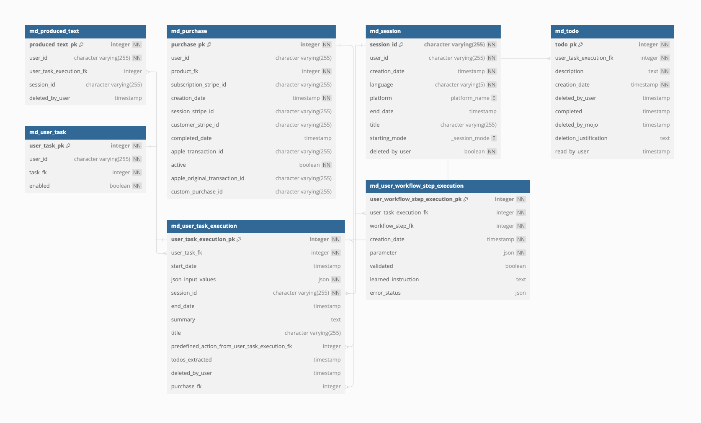