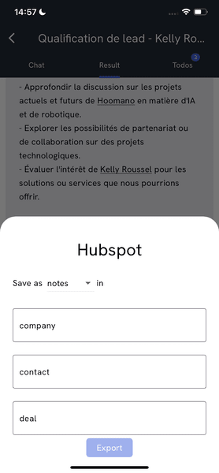
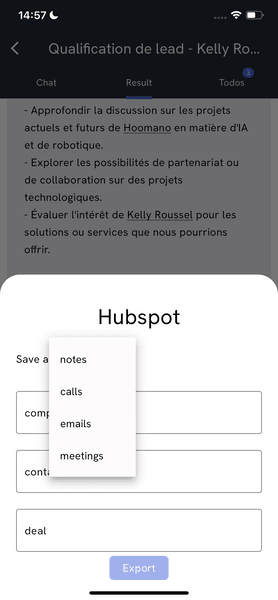
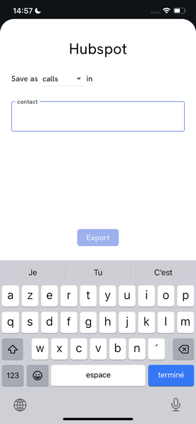
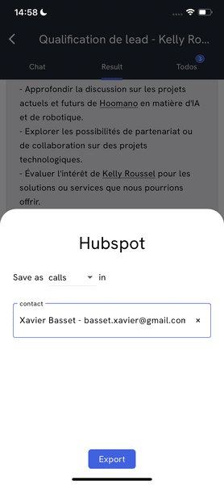

# Hubspot integration

Hubspot integration stands as a demonstration of how to integrate a third-party service with the platform. The integration is implemented as an action on task result to export a produced text directly to Hubspot.

## Configuration
Using Hubspot integration requires setting an `HUBSPOT_ACCESS_TOKEN` variable in the `.env` file of Mojodex project. The access token can be obtained from the[ Hubspot account settings](https://developers.hubspot.com/docs/api/private-apps).

For the "export to Hubspot" button to be display in mobile application, ensure the `HUBSPOT_BUTTON` variable is set to `"true"` in the `.env` file of the [mobile application](https://github.com/hoomano/mojodex_mobile).

## Export task result

### Backend
On the backend side, the integration is implemented as 2 routes. Resources can be found in `backend/app/routes/integrations/hubspot.py` file.

- GET route: retrieves `n_results` from `search_type` ('companies', 'contacts' or 'deals') which name starts with `search_string`. This route is used for user to browse their Hubspot account and select the entity to which the text will be exported.

- POST route: exports the task result associated with `produced_text_version_pk` as an `engagement_type` (among 'notes', 'emails', 'calls' and 'meetings') to `associated_object_id` of `associated_object_type` (among 'companies', 'contacts' or 'deals').

### Frontend
On frontend side, only [mobile application](https://github.com/hoomano/mojodex_mobile) supports Hubspot integration for now. The integration is implemented as an export button in the task result details view. 

The button opens a modal with a form to select the entity to which the text will be exported.

## Future work - Hubspot as third party tool
- Implement a tool to browse Hubspot entities past notes
- Use this tool to create a background task `Pre-call Brief`: `Create a concise summary of past interactions with the individual prior to initiating a business-oriented phone call.`