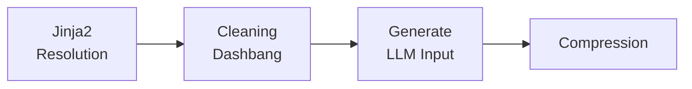

# Mojodex Prompt Template (MPT) File Format

## Introduction

This document introduces the Mojodex Prompt Template (`.mpt`) file format, a new standard designed to streamline and enhance the process of generating inputs for large language models (LLMs) within our development workflows. The `.mpt` format is a composition of jinja2 templating, HTML-like custom tagging for document formatting, and unstructured pseudo-code, enabling a flexible, powerful approach to crafting LLM prompts.

## Motivation

As our reliance on LLMs increases, the complexity and variety of prompts we need to generate have grown. Traditional methods of prompt creation often involve a cumbersome, error-prone process of manually editing and formatting text, lacking standardization and efficiency. The `.mpt` format aims to address these challenges by providing:

- **Standardization:** A unified file format allows for consistent prompt creation across different projects and teams.
- **Efficiency:** The use of jinja2 templating and custom tags streamlines the process of generating dynamic, complex prompts.
- **Flexibility:** Support for unstructured pseudo-code and custom tags ensures that developers can express a wide range of logic and formatting requirements.
- **Version Control:** A dash bang style header in each `.mpt` file specifies the LLM model version, author, and additional metadata, facilitating better management and compatibility of prompt templates over time.

## Key Principles

1. Prompting is coding: jinja2 templating and pseudo-code for dynamic, complex prompts.
2. Divide and conquer: unified prompting library for easy multi-LLM architecture strategy.
3. Token poor: reduce the token size of the prompt to optimize the LLM input.

## `.mpt` File Format Specification

### Header

The `.mpt` file begins with a dash bang style header that includes essential metadata:

``` bash
#! model-name: mistral-large
#! version: 
#! date: 2024-03-09 
#! author: Jane Doe 
#! documentation: https://example.com/mpt-docs
```

### Body

The body of the `.mpt` file contains a mix of jinja2 templates, custom HTML-like tags, and pseudo-code:


```html
<template>
    <title>
        Hello, {{ name }}! This is a sample template.   
    </title>    
    <content>
        <if not all informations required display a special message, otherwise do something>
    </custom_logic>
</template>
```

## MPT Workflow

Developers create `.mpt` files following the format specification. The runtime sequence involves:



1. **Jinja2 Resolution:** Templates are processed to substitute variables and expressions with actual values.
2. **Cleaning Dashbang:** The header is cleaned from the processing input to the LLM.
3. **Generate LLM Input:** The cleaned, resolved template serves as the input for the appropriate LLM.
4. **Compression:** Optimize the LLM input with compression algorithms to reduce the token size – this is optional and depends on the LLM model & tokenizer.

## Implementation Plan

The implementation involves developing a VSCode extension that supports the `.mpt` file format, including syntax highlighting, linting, and integration with LLM runtime processes.

## Conclusion

The `.mpt` file format represents a significant step forward in standardizing and optimizing the way we interact with LLMs. By adopting this format, we aim to enhance productivity, reduce errors, and foster innovation across our projects.