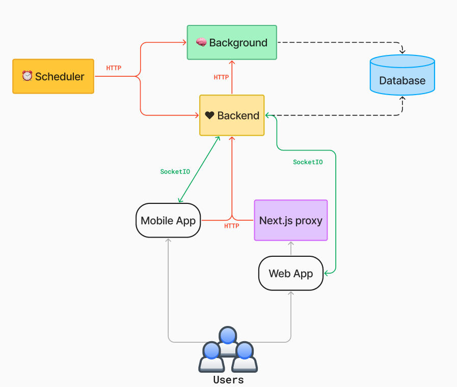

# Global Architecture

## Principles
Mojodex Architecture is built upon the foundational principles of System 1/System 2 abstraction, a concept derived from cognitive psychology.

-  System 1 represents fast, intuitive, and unconscious thinking.
-  System 2 embodies slower, deliberate, and analytical thought processes. 

By integrating these cognitive frameworks into its design, Mojodex aims to create a digital assistant system that combines the rapid responsiveness of System 1 with the careful decision-making of System 2. 

This documentation provides an overview of Mojodex's architecture, exploring how these cognitive principles inform its structure and functionality.

[Learn more about the System 1/System 2 abstraction](https://en.wikipedia.org/wiki/Thinking,_Fast_and_Slow)

## Architecture Overview

## Components
| Component    | Role                                      | Documentation Link                            |
|--------------|-------------------------------------------|-----------------------------------------------|
| Backend      | Communication hub for real-time dialogue and management of application business logic. Mojodex's Backend serves as the digital counterpart to System 1 thinking. | [Backend Documentation](backend.md)  |
| Background   | Handles intensive tasks behind-the-scenes. Useful for Long-Running Processes and Batch Data Processing. Mojodex's Background embodies the deliberate nature of System 2 thinking.| [Background Documentation](background.md)     |
| Scheduler    | Executes code at specific times/intervals. Mojodex's Scheduler embodies a proactive aspect akin to System 2 thinking| [Scheduler Documentation](scheduler.md)  |
| Database     | Stores and manages data                   | [Database Documentation](database.md)      |
| Mobile App   | Interface for mobile devices              | [Mobile App Documentation](https://github.com/hoomano/mojodex_mobile)|
| Web App      | Interface for web browsers                | [Web App Documentation](webapp.md)      |
| Next Proxy   | Manages and authenticates requests from the webapp interface to the backend.             | [Next Proxy Documentation](webapp.md) |

